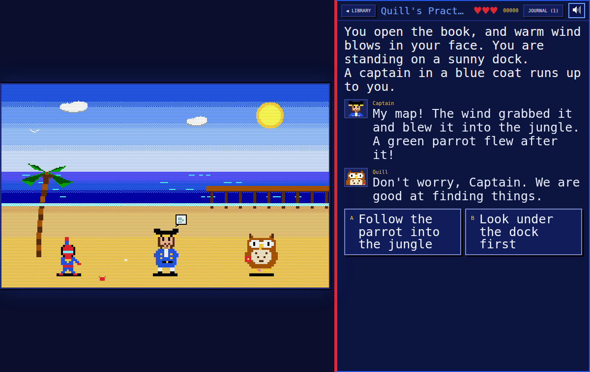

# Page Quest

**Page Quest · co-authored by SpiderBen10 (NZDO)**, created by **SpiderBen10 (NZDO)** for
**SpiderBen10's Arcade**. A choose-your-own-adventure reading game for grades 4–12 in the style of
80s Sierra/LucasArts adventure games: a 320×200 pixel scene with the characters on screen, and the
story below it (or beside it on wide screens) in big VT323 text, with read-aloud.



- **The Arcade Library** is the hub: a pixel library with **Quill**, the owl librarian (she gives
  the hints), the arcade's hero, and a bookshelf with **MYSTERY / ADVENTURE / SPACE** sections plus
  **MY BOOKS** (books written in the Writer's Desk). Each genre has a book for grades 4–5, 6–8 and
  9–12. Spines are tagged **YOUR LEVEL**, **EASY READ** (lower band) or **CHALLENGE** (higher band,
  still playable); your level's book is selected. The detail card shows the cover scene, blurb,
  reading level, and **endings found (x / y)**, with READ, or CONTINUE / START OVER for a book in
  progress (the current page is saved per book).
- **Reading:** each page draws its scene (20 procedurally drawn EGA-style backgrounds, animated:
  waves, torches, stars, lasers, rain, scrolling train windows...) with up to three characters (17
  original sprites with idle bobbing, blinking, moods on the face and in emote bubbles ♥ … ! ? and
  friends). The text types out (tap, Space or Enter skips); dialogue lines show the speaker's
  portrait while their sprite bobs and talks. Then pick a choice **A–D** (keys 1–4 / A–D or tap).
- **Gates** are Quill's skill questions inside the story: multiple choice (answers shuffled) or
  **put in order** (tap the torn map / diary pieces in the order they happened). Each gate is tagged
  with the NC standard for your grade (anchor `RL.3` → `RL.7.3` at grade 7) and recorded in the kit's
  per-standard progress.
- **Losing (by the player's grade, not the book's):**
  - **Grades 6–12:** a **COURAGE** meter of 3 hearts. A wrong answer costs a heart and shows Quill's
    hint; try again. At 0 hearts: **THE END?** → *Try again from checkpoint* (full hearts). The 6–8 and
    9–12 books also have **lose endings** (the thief escapes, the ship drifts off course...), with
    *Try again from checkpoint*.
  - **Grades 4–5:** no hearts, nothing is lost. First miss: Quill's hint. Second miss: Quill shows
    the right answer and the story goes on. If a grade 4–5 player reads a harder book and reaches a
    lose ending, it becomes a **DETOUR**: the page is read, the ending is added to the gallery, and
    Quill flies you back to the checkpoint.
- **Checkpoints** (`checkpoint` pages) also bring an **incoming transmission from Quill**: an ELA
  question from the shared kit bank with its explanation (+50 points; grades 6+ also win back a heart).
- **Clue Journal** (**J** or the JOURNAL button) lists the clues collected in this read.
- **Endings:** win, lose and **secret** endings. The ending screen shows the ending's name and type,
  the book's **endings gallery** (saved per browser), your score (gates right first try +100, later
  +25, win +300, secret +300 **+500 secret bonus**, a new ending +200, transmissions +50; high score
  via the kit), and a **mission report** by standard (code + skill, first-try results) with
  **practice next**.
- **HOW TO PLAY:** `src/stories/sample/tutorial.story` is a short practice book (8+ pages, one
  gate of each type, a win and a secret ending). It opens from the HOW TO PLAY button; it only shows
  inside its genre on the shelf when that genre has no real books yet.
- **Grades K–3** see a friendly *"Page Quest is for grades 4 and up"* screen with the ◀ ARCADE link.

## Writer's Desk (Nathan is the co-author)

From the library, **✎ WRITER'S DESK** opens an editor for your own books (desktop and iPad):

- Several drafts, saved in this browser (NEW / DELETE, pick from the list).
- **Book:** title, author, genre, band, cover scene, blurb (with a 120-character counter), start page.
- **Pages:** list, add, delete, rename (links follow the new name). Per page: scene and up to three
  cast members with moods (dropdowns, with a **live preview** of the scene), checkpoint, clues, the
  story text (blank line = new paragraph, `Quill: words` = dialogue, `~ Chapter Two ~` = heading),
  and how the page ends: **choices** (text + a target page from a dropdown, or *+ new page…*), a
  **question gate** (multiple choice or put-in-order, the standard anchor, Quill's hint, the next
  page), or an **ending** (win / secret / lose, lose only for 6-8 and 9-12).
- A **live validator** (the same one `npm test` uses; click a problem to jump to its page) and a
  **reading-level meter** (Flesch–Kincaid grade against the band).
- **PLAYTEST** from the current page or from the start (drafts don't touch your endings gallery).
- **EXPORT** downloads the `.story` file; **IMPORT** loads one (file picker) and **PASTE** takes pasted text.
- Drafts appear on the shelf under **MY BOOKS · by SpiderBen10**.
- Typing in the editor never triggers game keys (A–D, J, P, M...).

### Shipping a book you wrote (so everyone gets it)

1. In the Writer's Desk, make sure the CHECK panel says **READY ✔**, then press **EXPORT**. You get
   a file such as `the-cave-of-echoes.story`.
2. Put it in the game's `src/stories/` folder, in the folder for its band:
   `src/stories/4-5/`, `src/stories/6-8/` or `src/stories/9-12/` (for example
   `games/page-quest/src/stories/6-8/the-cave-of-echoes.story` in the arcade repository). Any file
   name ending in `.story` works; the book's genre and band come from its header.
3. Run `npm test` (it checks every book and prints its reading level) and `npm run build`.
4. Commit and push; the arcade's deploy publishes it. The book appears on the shelf for everyone, in
   its genre, with the author name from its header (use `author: SpiderBen10`).

Books can also be written by hand in any text editor, in the format below.

## The `.story` format

Plain UTF-8 text: a header (`title`, `author`, `genre` mystery|adventure|space, `band`
4-5|6-8|9-12, `cover` scene id, `blurb` ≤ 120 characters, `start` page id), then pages starting with
`=== page-id`. Each page has `scene:`, optional `cast:` (0–3 characters, `id[:mood]`),
`checkpoint`, `clue:` lines, body text and ends with ONE of: 1–4 choices (`> text -> page-id`, text ≤
48 characters), a gate (`? RL.3 : question` with 2–4 `+`/`-` answers ≤ 70 characters and exactly one
`+`, or `? RL.5 order : question` with 3–5 numbered items; then `hint:` and `next:`), or
`end: win|lose|secret Ending Name`. `#` lines are comments. The full contract is in the Page Quest
design brief (`PAGE_QUEST.md`); scenes and characters are listed in `src/story/roster.ts`.

**How this engine reads the parts the brief leaves open** (the most lenient reasonable reading):

- **Moods not in the list** that writers commonly use are accepted with a warning and shown as the
  nearest mood (the brief's own example uses `captain:worried` → *scared*; also nervous/afraid →
  scared, upset → sad, mad → angry, shocked → surprised, confused/curious → thinking,
  excited/proud → happy, calm/neutral → normal). Other unknown moods are errors.
- **Dialogue:** a line `Name: words` is dialogue only when *Name* is a roster display name; any other
  `Word: text` line is narration. A roster character who speaks without being in `cast` is a warning
  (the line still shows their portrait); `Hero:` lines are a warning (the hero never talks).
- **Paragraphs:** consecutive body lines stay separate lines inside one paragraph (poems, logs); a
  blank line starts a new paragraph. `~ Chapter Two ~` lines are headings.
- **`clue:`, `scene:`, `cast:` and `checkpoint`** may appear anywhere in the page. Story text after
  the choices/gate/ending is still shown, with a warning.
- **Choices** split on the **last** `->` (so the text may contain `->` or quotes); `→` also works.
- **Anchors** written with a grade (`RL.7.3`) are normalised to `RL.3` with a warning. Order items
  may be written `1 text`, `1. text` or `1) text`; out-of-sequence numbers are a warning (file order
  is used), and item text may itself start with a digit.
- **Gates** count as the page's way forward (`next:`); a page with no choices, gate or ending is an
  error, and so is any page that can be read but can never reach an ending (a loop with no exit).
- **Reading level** is the Flesch–Kincaid grade of all narration, dialogue and headings (speaker
  labels and clues excluded; "Mr./Mrs./Ms./Dr." don't end sentences; "..." is a pause).
- **Books with errors** are left off the shelf (a console warning says so); `npm test` fails on them.
- A **lose ending reached by a grade 4–5 player** (only possible in a CHALLENGE book) is a detour,
  as described above.
- **RF anchors** (foundational skills) end at grade 5; from grade 6 up, `RF.3` is reported as `L.x.4`
  and `RF.4` as `RL.x.10` (see *Codes to verify*).

## Grades and standards

Gates are written with a standard anchor; the game reports it at the player's grade. The transmissions
come from the kit's ELA bank for the player's grade.

| Grade | Books | Gate codes (anchors used in the books) | Losing |
|---|---|---|---|
| K–3 | — ("for grades 4 and up" screen) | — | — |
| 4 | 4–5 YOUR LEVEL; 6–8 and 9–12 CHALLENGE | RL.4.1–RL.4.6, RI.4.1, RI.4.3–RI.4.5, L.4.1, L.4.2, L.4.4, L.4.5 | never: hint, then the answer is shown |
| 5 | same | RL.5.x, RI.5.x, L.5.x | never |
| 6 | 6–8 YOUR LEVEL; 4–5 EASY READ; 9–12 CHALLENGE | RL.6.1–RL.6.6, RI.6.1, RI.6.2, L.6.1, L.6.4, L.6.5 | 3 hearts, checkpoints, lose endings |
| 7 | same | RL.7.x, RI.7.x, L.7.x (e.g. RL.7.3 characters, setting & plot) | same |
| 8 | same | RL.8.x, RI.8.x, L.8.x | same |
| 9–10 (English I–II) | 9–12 YOUR LEVEL; others EASY READ | RL.9-10.1–RL.9-10.6, RL.9-10.9, RI.9-10.6, RI.9-10.8, L.9-10.1, L.9-10.2, L.9-10.4, L.9-10.5 | same |
| 11–12 (English III–IV) | same | RL.11-12.x, RI.11-12.x, L.11-12.x (e.g. RL.11-12.3) | same |

Skills by anchor: RL.1 cite text evidence, RL.2 theme & summary, RL.3 characters, setting & plot,
RL.4 word meaning & tone, RL.5 story structure & order, RL.6 point of view, RL.9 compare stories,
RI.1–RI.9 the informational-text versions (main idea, text structure, author's purpose, claims &
evidence...), L.1 grammar, L.2 capitals/punctuation/spelling, L.4 word meaning from clues, L.5
figurative language, W.1–W.3 opinion/informative/narrative writing.

The 10 books on the shelf now (`npm test` output): 4–5 books read at Flesch–Kincaid grade 3.7–4.2,
6–8 books at 6.4–7.1, 9–12 books at 8.4–9.2; 31–40 pages each, 11–14 gates, 3–6 endings.

### Codes to verify

The official NC DPI site is blocked in this sandbox. Codes follow the kit's forms and its notes
(`src/kit/banks/ela/NOTES.md`): RL/RI/L/W numbering from grade 3 up is assumed to match the Common
Core anchors, which NC's 2017 ELA standards keep.

- **RL.x.7 / RL.x.8:** RL.8 does not exist for literature (the validator warns); RL.7 (media) is allowed.
- **RF.3 / RF.4 at grades 6–12** are reported as **L.x.4** and **RL.x.10**; NC's RF strand ends at
  grade 5. RL.x.10 (range of reading) is assumed to exist in NC as in the Common Core.
- **W.1–W.3** as gate anchors: NC reorganised some writing standards in 2017; W.x.1–W.x.3 are assumed.

## Controls

| Keyboard | Touch | Action |
|---|---|---|
| Space / Enter, or click the scene | tap the scene or the text | Show the whole page at once |
| 1–4 or A–D | tap | Pick a choice / answer a gate |
| A–E or 1–5 | tap the pieces | Order gates: pick the pieces in order |
| Enter / Space | CONTINUE / THE END buttons | Continue after a gate, finish an ending |
| J | JOURNAL | Clue Journal |
| R | speaker button | Read the page (or question) aloud |
| ← → , Enter | tap a spine, READ | Library: pick a book, read it |
| P / Esc, M | toolbar | Pause, mute |

The toolbar has **◀ ARCADE** (back to the arcade, keeping the grade), PAUSE, SOUND and READ ALOUD
(off by default for grades 4+; the choice is remembered). When the game is opened from the arcade
with `?grade=`, the library shows that grade and *CHANGE GRADE IN THE ARCADE*; otherwise it has a
K–12 picker.

## Run it locally

```sh
npm install
npm run dev        # http://localhost:8080
npm run build      # type-check + production build into dist/
npm test           # parser/validator unit tests + checks every src/stories/**/*.story
```

`npm test` runs `scripts/test-story.ts` (parser, validator, serializer round-trip, Writer's Desk
draft round-trip, readability, standard codes, and the hearts/reveal/order-gate rules on small inline
stories, including broken ones) and `scripts/check-stories.ts` (validates every book, prints its
stats and reading level, checks every scene and character has art, and fails on any error).

`scripts/playtest.cjs` is an automated Playwright playtest (needs `npx vite preview --port 4417 --host 127.0.0.1`):
grades K and 3 (the 4+ screen), 4, 7 and 11 with the keyboard at 1280×800 and with touch at 1080×810,
plus the grade picker. It plays the sample book to both endings (gates by keys and by taps, the
journal, a transmission), loses by hearts at grade 7 and 11 (back to the checkpoint with full hearts),
checks that grade 4 never loses, a lose ending (*Try again from checkpoint*, or the grade 4 detour),
CONTINUE, the shelf tags, the layout, and the Writer's Desk (a 3-page book, playtest, export,
re-import, MY BOOKS). `SHOT=1` saves `docs/screenshot.png` (scene + text) and `docs/scene.png` (the
640×400 canvas). `?debug` exposes a few handles as `window.__pq`.

Code map: `src/story/` (roster, parser, validator, serializer, readability, standards),
`src/play/` (reading rules, saves), `src/engine/` (bitmap font, pixel drawing, scenes, sprites,
moods, renderer), `src/ui/` (library, reader, Writer's Desk, CSS), `src/writer/draft.ts`,
`src/books.ts` (loads `src/stories/**/*.story` with `import.meta.glob`). `src/kit` is the shared
arcade kit (copy the canonical `kit/` folder there before building).

## Deploying

Page Quest lives in SpiderBen10's Arcade repository at `games/page-quest/`. The arcade's deploy
workflow builds and tests it and publishes it at `/page-quest/` on the arcade's Azure app (Vite
`base: "./"`), so it needs no Azure app or token of its own. See the arcade README.

## Credits

Game design, characters and books: **created by SpiderBen10 (NZDO)**; Page Quest is
**co-authored by SpiderBen10 (NZDO)**. Quill, the cast and every scene are original pixel art drawn in
code; the hero is the arcade's own original hero. No trademarked characters or places.
