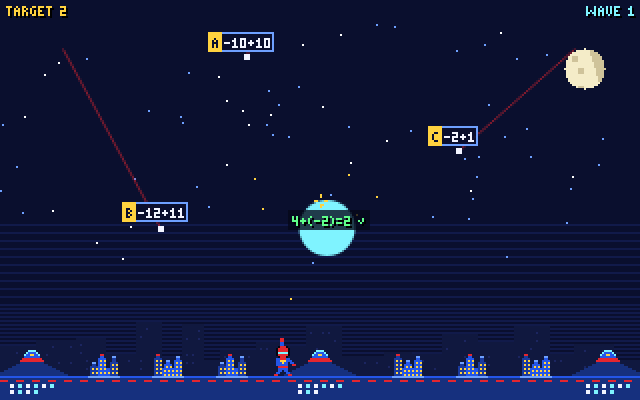

# City Shield

A *Missile Command*-style math arcade game for **SpiderBen10's Arcade** (grades K–12, North Carolina
Standard Course of Study for Mathematics). Created by **SpiderBen10 (NZDO)**.



Six pixel cities sit under a night sky, guarded by three web launchers and the arcade's hero.
Missiles fall on slanted paths, and **every missile carries some math**.

- **TARGET waves.** The screen shows a target, like `TARGET 24`, `TARGET x = 4` or `TARGET √3/2`.
  Missiles whose value **equals the target are live warheads**: if one lands, a city is destroyed.
  The others are **decoys that burn up by themselves** just above the city. Shooting a decoy wastes
  a web and costs points, and the screen shows why, e.g. `13+4=17, NOT 24`. Many decoys are *traps*
  built from common mistakes: `3+5×4` when the target is 32, `0.6×0.4` when it's 2.4, `4×(−6)` when it's 24,
  `2⁴·2²` when it's 2⁸, `2x+2=6` when x = 4 is only what you'd get by adding instead of subtracting.
- **STOP THE WRONG ANSWERS waves** (every third wave). Each missile carries a claim like `6×7=48`
  or `sin 30°=√3/2`. The wrong claims are live; the true ones are harmless. Stop a wrong one and the
  screen shows the fix (`FIXED: 6×7=42`).
- **Web blasts** expand into circles and destroy every missile they touch. Each launcher has 10 webs
  a wave (12 for K–2). A live missile stopped scores 50 × your streak (up to ×5); a decoy left alone
  scores 10.
- **Always playable:** the four missiles nearest the ground wear letter badges **A–D** (all missiles
  get letters, live or not, so the letters don't give the answer away). Press **A–D / 1–4**, tap the
  **A–D buttons** under the screen, or **tap / click a missile** to fire a homing web that can't miss.
  Aiming with the crosshair is only needed for chain shots.
- **Between waves:** a bonus for every city saved and every web left, then an **incoming transmission**:
  a multiple-choice math question for your grade from the arcade kit (`QuestionDeck(grade, "math")`)
  with its explanation. A right answer **rebuilds a destroyed city** (or gives +250 if none are lost).
- **Game over** when every city has fallen. The **mission report** lists results by NC standard
  (code + skill) for both the missile calls and the transmissions, plus what to practice next.

## Grades

The grade comes from the arcade link (`?grade=K` … `?grade=12`); the game then shows the grade and a
*Change grade in the arcade* link. Opened directly, it shows its own K–12 picker (default grade 5).
All missile math is generated in `src/shield/missions.ts` with exact arithmetic (fractions and
radicals are never floating point). Waves rotate through each grade's skills.

| Grade | Missile math | Example (TARGET: live missiles) | Standards |
|---|---|---|---|
| K | Add/subtract within 5 · number pairs to 10 | `TARGET 5`: `3+2`, `4+1`, `5−0` | NC.K.OA.5, NC.K.OA.3 |
| 1 | Add/subtract within 20 · two-digit + tens/ones | `TARGET 13`: `9+4`, `20−7`; `TARGET 54`: `34+20` | NC.1.OA.6, NC.1.NBT.4 |
| 2 | Add/subtract within 100 · expanded form | `TARGET 63`: `38+25`, `81−18`; `TARGET 347`: `300+40+7` | NC.2.NBT.5, NC.2.NBT.3 |
| 3 | Multiplication and division facts | `TARGET 24`: `6×4`, `3×8`; `TARGET 6`: `42÷7` | NC.3.OA.7 |
| 4 | Factor pairs · multi-digit multiplication | `TARGET 48`: `3×16`, `4×12`; `TARGET 252`: `36×7`, `14×18` | NC.4.OA.4, NC.4.NBT.5 |
| 5 | Order of operations with ( ) and [ ] · decimals | `TARGET 32`: `(3+5)×4` (decoy `3+5×4`); `TARGET 2.4`: `0.6×4` | NC.5.OA.2, NC.5.NBT.7 |
| 6 | Exponents in expressions · dividing fractions | `TARGET 45`: `6²+3²`, `5×3²`; `TARGET 6`: `3/4÷1/8` | NC.6.EE.1, NC.6.NS.1 |
| 7 | Add/subtract · multiply/divide integers | `TARGET −4`: `−7−(−3)`; `TARGET −24`: `8×(−3)`, `48÷(−2)` | NC.7.NS.1, NC.7.NS.2 |
| 8 | Exponent rules · square/cube roots · scientific notation | `TARGET 2⁸`: `2³·2⁵`, `(2⁴)²`; `TARGET 7`: `√49`, `∛343`; `TARGET 6×10⁸`: `(2×10³)(3×10⁵)` | NC.8.EE.1, NC.8.EE.2, NC.8.EE.4 |
| 9 (NC Math 1) | Evaluate functions · solve linear equations | `f(x)=2x+1 g(x)=x²−3`, `TARGET 13`: `f(6)`, `g(4)`; `TARGET x = 4`: `2x+3=11`, `3(x−2)=6` | NC.M1.F-IF.2, NC.M1.A-REI.3 |
| 10 (NC Math 2) | Simplify radicals · rational exponents · equations with x on both sides | `TARGET 4√2`: `√32`, `2√8`, `√2+3√2`; `TARGET 4`: `8²ᐟ³`, `16¹ᐟ²`; `5x−3=2x+9` | NC.M2.N-RN.2, NC.M1.A-REI.3 |
| 11 (NC Math 3) | Logarithms · unit-circle values (degrees) | `TARGET 3`: `log₂8`, `log 1000`; `TARGET √3/2`: `sin 60°`, `cos 330°` | NC.M3.F-LE.4, NC.M3.F-TF.2 |
| 12 (NC Math 4) | Composite functions · log equations · unit circle (radians) | `TARGET 14`: `f(g(2))`; `TARGET x = 64`: `log₂x=6`, `log₄x=3`; `sin(π/6)` | NC.M4.AF.1.2, NC.M4.AF.3.2, NC.M3.F-TF.2 |

**K–2** get slower missiles (about 20 seconds to fall), at most 2–3 on screen, double-size labels,
bigger blasts, 12 webs per launcher, bigger text, and **read-aloud on by default**: the target is
read at the start of each wave, and the speaker button (or **R**) reads the target and the A–D
missiles. Difficulty (speed, missiles per wave, missiles at once) rises by grade band and every wave.

### Codes to double-check

These follow the forms the arcade kit uses; the NC DPI site couldn't be reached to verify them.

- `NC.K.OA.3` for "number pairs that make a number to 10" (decomposing numbers ≤ 10).
- `NC.2.NBT.3` for expanded form (read and write numbers … in expanded form).
- `NC.M4.AF.3.2` for solving logarithmic equations (taken from the kit's own Math 4 generators).
- Grade 10 reuses `NC.M1.A-REI.3` (linear equations with x on both sides) and grade 12 reuses
  `NC.M3.F-TF.2` (unit-circle values, in radians) as review standards.

## Controls

| | Keyboard | Mouse / touch (iPad, phones) |
|---|---|---|
| Auto-target a lettered missile (homing web) | A–D or 1–4 | tap the missile, or the A–D buttons under the screen |
| Fire at the crosshair | ←↑↓→ move, Space / Enter fire | click or tap the sky |
| Read the target (and A–D missiles) aloud | R | speaker button |
| Pause / sound | P or Esc / M | toolbar |
| Answer a transmission | 1–4 or A–D, then Enter | tap an answer, then *Next wave* |

Letters A–D are never movement keys. The 320×200 pixel screen scales to fit any window (desktop, iPad
landscape and portrait, phones), with no page scroll.

## Run it locally

```sh
npm install
npm run dev        # http://localhost:8080
npm test           # content checks for every grade (independent evaluator, label widths, …)
npm run build      # type-check + production build into dist/
```

`npm test` runs `scripts/check-missiles.ts`: for all 13 grades and 12 waves it generates thousands of
missiles and re-evaluates each label with its own parser (exact BigInt fractions; floating point only
for π, trig and irrational roots). Live missiles must equal the target, decoys must not, WRONG-wave
claims must really be wrong (or right), every shown fact must be true, equations must have exactly
the stated solution, and every label and note must fit on screen in the pixel font.

`scripts/playtest.cjs` is a Playwright playtest (keyboard at 1280×800 and touch on an iPad-size screen,
grades K, 3, 7 and 11, plus the grade picker). Run it against `npx vite preview --port 4404 --host 127.0.0.1`.

Code map: `src/CityShield.tsx` (screens, HUD, target bar, A–D buttons, transmissions, report),
`src/shield/engine.ts` (game loop and drawing), `src/shield/missions.ts` (skills, targets, missiles,
notes), `src/shield/value.ts` (exact numbers), `src/shield/font.ts` (the pixel font, with exponents,
subscripts and root bars), `src/shield/sprites.ts`. `src/kit` is SpiderBen10's Arcade shared kit (do not edit here).

## Deploying

City Shield lives in SpiderBen10's Arcade repository (`games/city-shield/`). The arcade's deploy workflow
builds and tests it and publishes it at `/city-shield/` on the arcade's Azure app, so it needs no Azure
app or token of its own. See the arcade README.

## Credits

Game design and characters: **created by SpiderBen10 (NZDO)**. The hero is an original character.
