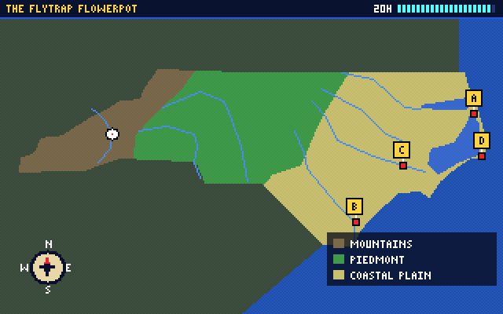
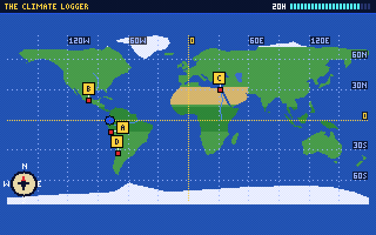

# Clue Compass

A geography detective chase for **SpiderBen10's Arcade**, grades **K–12**, created by **SpiderBen10 (NZDO)**.

**Pocket**, a cheeky runaway robot with a very big pocket, keeps *borrowing* things (a fire station bell,
a lighthouse lamp, a torch keychain…) and leaving IOU notes. The arcade hero follows the trail with **Pip**,
a homing pigeon who carries transmissions. At each stop you ask witnesses for clues about where Pocket went
next, then pick one of four destinations (the multiple-choice question). A wrong trip costs time, and a
friendly local explains why Pocket isn't there: that explanation is the lesson. Pocket's IOU notes fill a
notebook that describes the hideout, and the last choice is the hideout itself. Pocket always gives the
thing back.

The chase mechanic is inspired by *Where in the World Is Carmen Sandiego?* (1985). Everything else is
original: no red coat or fedora, no ACME or V.I.L.E., no detective ranks, no look-alike screens or music.





## How a case plays

1. **Brief:** what Pocket borrowed (read aloud for K–2).
2. **Stop:** up to 3 witnesses (each costs 1 hour for grades 3–5) give clues about the *next* place:
   community helpers, sounds and things (K); map directions, continents, oceans, animals and NC map
   symbols (1–2); NC regions, climate, landforms and neighbor states (3); NC rivers, landmarks, state
   symbols, people and history places (4); U.S. regions, capitals, landforms, landmarks and a few world
   capitals (5); world landforms, deserts, mountain ranges, river valleys and eight-point directions (6);
   countries, capitals, languages, currencies, flags and exports (7); NC and U.S. population, ports,
   interstates, industries and regions (8); latitude/longitude, UTC offsets, climate graphs, plate
   boundaries, population and trade (9–12). K–2 clues are pictures with read-aloud; 3–12 clues are
   reading-inference sentences that get longer by band (90 / 110 / 120 / 140 characters).
3. **Travel:** pick A–D on the panel, press 1–4 / A–D, or tap a lettered pin on the pixel map (V shows
   the map with a compass rose). Pip flies the dotted route.
4. **Wrong trip:** 4 hours lost; a local says what is true there and what the clue pointed to.
5. **Hideout:** at the last stop the notebook (one IOU note per stop) is the clue set.
6. **Between cases:** a transmission question from the kit social studies deck at the player's grade.
7. **Mission report** (2 cases for K–2, 3 for grades 3–12): results by NC standard, practice next, and
   what the locals taught you.

Grades 3–12 have a clock (compass charges in hours), a little tighter each band (legs × 4 + 10 hours in
grade 3 down to legs × 4 + 6 in grades 7–8); if it runs out, Pocket zips away but leaves the item with a
sorry note. K–2 have no clock. Grades 6–12 get near-miss distractors (a neighbouring country, the same
currency or language, a look-alike flag, the same time zone on another continent, the same climate in
the other hemisphere), and every wrong trip is explained by a friendly local.

**Grades 9–12: mixed-up witnesses.** On some legs one witness is mixed up: they tell a true fact about
one of the *wrong* destinations. The other witnesses always out-vote them (the tests prove it), Pocket's
IOU notes are always true, and if you follow the mixed-up witness the local explains what happened. The
world map shows a latitude/longitude grid every 30° for these grades.

Grades 5–12 also see a small "also try **Thread Chasers**" note on the title screen (world *history* is
Thread Chasers' job; Clue Compass stays with present-day geography). `site/games.js` lists this game for
grades `K`–`12`.

## Controls

| Action | Keyboard | Touch |
|---|---|---|
| Pick a witness / talk | ← → then Enter or Space | tap the witness on the screen (up to 4) or in the panel |
| Travel (answer) | 1–4 or A–D | tap A–D in the panel, or the lettered pin on the map |
| Map / scene | V | MAP button |
| Read aloud again | R | speaker button |
| Pause / mute | P / M | toolbar |

Read-aloud is on by default for K–2 (kit `readAloudPref`) and reads briefs, clues, IOU notes, choices,
lessons and transmissions.

## Content by grade

| Grade | Cases (stops) | Map and places | Clue skills | NC codes |
|---|---|---|---|---|
| K | 6 (4 each) | Compass Corners, a made-up town: 10 places | community helpers, their things and sounds (pictures) | K.E.1, K.G.1.1 |
| 1–2 | 6 (4–5) | town (directions), world (7 continents, 5 oceans), NC map symbols | N/S/E/W, continents and oceans, animals, landmarks, map symbols | 1.C&G.1.1, 1.G.1, 1.G.1.2, RI.1.1 / 2.G.1, 2.G.1.1, RI.2.1 |
| 3 | 6 (4–5) | NC (regions shaded) and the U.S. (NC's neighbors) | regions, climate, landforms, capitals, neighbor states | 3.G.1.1, 3.G.1.2, RI.3.1, L.3.4 |
| 4 | 6 (4–5) | NC: 23 places | regions, rivers, landmarks, state symbols, American Indian nations, history places | 4.G.1, 4.G.1.1, 4.G.1.2, 4.E.1, 4.H.1, 4.H.1.1, RI.4.1, L.4.4 |
| 5 | 6 (4–6) | U.S. (23 places) and world capitals (7) | five U.S. regions, capitals, landforms, landmarks, continents | 5.G.1.1, RI.5.1, L.5.4 |
| 6 | 6 (4–5) | world map: 20 present-day landforms, deserts, ranges and river valleys (Nile, Tigris–Euphrates, Indus, Huang He as the places they are today) | continents, countries, hemispheres, rivers' mouths and flow, records, eight-point directions between pins | 6.G.1, 6.G.1.1, 6.G.1.2, RI.6.1 |
| 7 | 6 (5) | world map: 25 capitals | capitals, main languages, currencies, flags (in words plus a pixel flag), top exports; near-miss distractors | 7.G.1, 7.B.1.1, 7.E.1, RI.7.1 |
| 8 | 6 (4–5) | NC (3 cases) and the U.S. (3 cases): 42 places, 9 new | 2020 Census population ranks, deepwater ports, interstates, airline/rail hubs, industries, regions and landforms | 8.G.1, 8.G.1.1, 8.E.1.1, RI.8.1, L.8.4 |
| 9–12 | 6 (5–6) | world map with a lat/long grid: 23 places | latitude/longitude (e.g. "near 48°N, 2°E"), UTC offsets, climate graphs described in words, plate boundaries, population and urbanization (dated), trade; mixed-up witnesses | WH.G.1, WH.G.1.1, WH.E.1, ESS.EES.2.2, ESS.EES.3, RI.9-10.1 / RI.11-12.1 |

54 cases, 136 places, 599 facts (each with a source). Transmissions use the kit social bank
(`QuestionDeck(grade, "social")`), so their codes come from the kit (grades 9–12 follow the kit's course
order: World History, Civic Literacy, American History, EPF).

### Codes to verify

Forms follow the kit social bank (`kit/banks/social/NOTES.md`). The NC DPI site is blocked here, so:
- **Standard-level codes** (objective unknown): `K.E.1` (helpers' jobs), `1.G.1` (directions, maps and
  globes), `2.G.1` (continents and oceans), `4.G.1` (landmarks), `4.E.1` (NC resources and state
  symbols), `4.H.1` (history places).
- **Objective guesses to confirm:** `1.C&G.1.1` for community helpers (the kit bank uses it), `2.G.1.1`
  for directions and community places, `3.G.1.2` for landforms/climate, `4.G.1.2` for rivers as
  movement, `4.H.1.1` for the Eastern Band of Cherokee and the Lumbee, and `5.G.1.1` for state
  capitals and **world** capitals (grade 5 is U.S.-focused; world stops are a light extension).
- ELA: `RI.x.1` for reading clues (grades 1–12; `RI.9-10.1` and `RI.11-12.1` in high school) and `L.x.4`
  when a clue uses a geography word such as *barrier island*, *sound*, *spire*, *dune*, *peak*, *port* or
  *canyon* (grades 3+), and from grade 6 *loess* and the plate-boundary words *divergent*, *convergent* and
  *transform*.
- **Grade 6:** `6.G.1.1` (human and physical characteristics and settlement; used for the river-valley
  "early civilization grew here" context and the Yellow River) and `6.G.1.2` (adapting to topography,
  climate, bodies of water and resources; used for landforms, deserts, rivers) were seen in search
  excerpts. `6.G.1` (standard level) is used for continents, countries, hemispheres and eight-point
  directions: there may be a better-fitting map-skills objective.
- **Grade 7:** `7.G.1` is standard level (countries, capitals, flags). `7.G.1.1` (environment and human
  response) and `7.E.1.1` (factors behind economic systems) were seen in excerpts but fit only loosely, so
  money and exports use standard-level `7.E.1`. `7.B.1.1` for languages is a guess from the kit bank.
- **Grade 8:** `8.G.1.1` ("how location and place have presented opportunities and challenges for the
  movement of people, goods, and ideas") was confirmed and is used for ports, interstates, hubs and
  crossings; `8.E.1.1` (economic growth and decline) for industries. Regions, landforms and population
  use standard-level `8.G.1` (excerpts disagreed on `8.G.1.2`).
- **Grades 9–12** (one band; high-school courses are not tied to a grade): `ESS.EES.2.2` (predict
  volcano and earthquake locations from plate boundaries) was confirmed; `ESS.EES.3` (atmosphere and
  climate) is standard level, as in the kit's science notes. `WH.G.1.1` (migration and *settlement*) is
  used for population and urbanization, `WH.G.1` (standard level) for latitude/longitude and time zones,
  and `WH.E.1` (standard level) for resources and trade: none of the World History objectives seen is
  about map coordinates, so these are the least certain. Civic Literacy (`CL.G.1.x`) and EPF (`EPF.E.x`)
  were considered but don't honestly fit these clues.

Facts and sources: see [docs/sources.md](docs/sources.md) (what was checked by web search and what is
general knowledge cited to an overview source).

## Code layout

```
src/chase/      shareable chase engine (no Clue Compass story, no DOM)
  types.ts      Place, Fact, CaseDef, Leg, Tag
  geo.ts        lat/long → pixel projection per map (+ inverse), point-in-polygon, compass directions,
                NC region lookup
  outlines.ts   NC (sounds, Blue Ridge front, Fall Line, rivers), lower-48 U.S. (lakes, rivers), world
  logic.ts      clue resolution, "does this clue fit that place", dead-end lessons, validateCase()
                (including the majority-vote proof for mixed-up witnesses)
  session.ts    CaseRun: one case in play (stops, witnesses, notebook, charges, tried options)
src/data/       Clue Compass content: places-town/nc/us/world.ts (K–5), places-g6.ts, places-global.ts
                (grades 7 and 9–12, plus extra facts for the K–5 world capitals), places-g8.ts (new NC/U.S.
                pins plus extra facts for K–5 NC/U.S. places), cases.ts, sources.ts, bands.ts (codes)
src/gfx/        bitmap font, pixel helpers, icons (picture clues), sprites, render.ts (scenes, maps, travel)
src/game.ts     missions, travel animation, transmissions, scoring, recording by standard
src/ClueCompass.tsx, src/ui/cc.css   toolbar, screen + text panel layout, panels, report
src/kit/        the arcade kit (unchanged copy)
```

**Shareable with Thread Chasers:** `src/chase/*` is data-driven. A time chase can reuse `CaseRun`,
`validateCase` (solvable cases, no accidental right answers, every dead end explained), the projection,
pin and direction math and the world outline, adding an era field to `Fact`/`Tag` and its own map frames.
`gfx/render.ts` map drawing and the label spreading are generic over `MapId`.

## Run, test, playtest

```
npm install
npm run dev            # local dev server
npm run build          # tsc (strict) + vite build
npm test               # tsx scripts/check-game.ts
npm run build && npx vite preview --port 4645 --host 127.0.0.1 &
BASE=http://127.0.0.1:4645/ node scripts/playtest.cjs   # SHOT=1 also writes docs/screenshot.png and docs/world.png
```

`npm test` checks: every case solvable (played by the real `CaseRun`, with and without mistakes and
within the clock; for grades 6–12 also a careful player who asks every witness, decides by majority vote
and makes a wrong trip), no wrong destination fits all clues (K–2: no wrong destination fits *any* picture
clue), every dead end has an explanation, clue length per band (60 / 90 / 110 / 120 / 110 / 120 / 120 /
140), no clue names its answer, mixed-up witnesses (true fact of a wrong option, always out-voted, the
local explains them, some legs but never all), K–2 picture icons and read-aloud text, the facts table
(sources, required keys, unique town facts, dated figures), standards codes per grade (high-school course
prefixes for 9–12), and map pins (inside the map, state and country bounding boxes, country facts match
the pin, NC outline and the region the pin falls in, U.S. outline and not in a lake, the right continent
or open ocean, choices never stacked on one spot), lat/long clue text within ±1° of the pin, UTC offsets
that fit the longitude, winter-rain graphs in the right hemisphere, plus the kit social bank for every
grade. `npx tsx scripts/sources-doc.ts` regenerates the source list in `docs/sources.md`.

The playtest plays whole missions at grades K, 2, 4, 5, 6, 7, 8 and 11 on keyboard 1280×800 and iPad
touch 1080×810 and 810×1080 (checking the band and the standards in the report), taps the 4th witness at
a mixed-up stop in grade 11, checks the lat/long grid, and covers brief, witnesses (including a tap on the canvas sprite), a wrong trip and its
lesson, a map-pin tap, the hideout, transmissions by key and by tap, and the report, checking for page
errors, page scroll and that the screen fits. `?debug` exposes the game as `window.__cc`; `&fast` makes
travel instant.

## Deploying

Clue Compass lives in SpiderBen10's Arcade repository (`games/clue-compass/`). The arcade's deploy workflow
builds and tests it and publishes it at `/clue-compass/` on the arcade's Azure app, so it needs no Azure
app or token of its own. See the arcade README.

## Kit suggestions

- `QuestionDeck` could accept a list of skills/standards to prefer (e.g. geography items for
  transmissions in a geography game).
- A shared `Icon`/bitmap-font module would save every game re-copying `font.ts` and `gfx.ts`.

## Credits

Created by SpiderBen10 (NZDO). Pixel art, characters (Pocket, Pip), music and maps are original.
