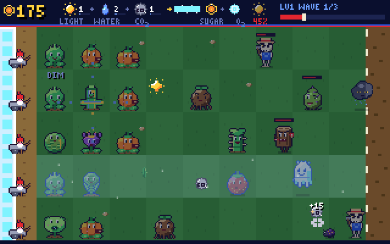

# Plants vs Undead

A lane-defense learning game for **SpiderBen10's Arcade** about **the parts of a plant and
photosynthesis** (K–12 science, North Carolina Standard Course of Study). Silly, slow, shambling
undead come across a backyard lawn from the right. You grow cute plant parts in the grass to stop
them before they reach your greenhouse on the left.

Created by SpiderBen10 (NZDO).



## The science is the game

**Glucose (sugar) is the money, and photosynthesis makes it.** The HUD bar at the top of the lawn
is a photosynthesis meter:

```
sunlight + water + CO₂  →  [leaf factory]  →  glucose + O₂
```

- **Sunlight** falls from the sky as glowing motes. Tap or click them, or move the cursor onto
  them. Motes that land on a leaf (Sunleaf, Chloro Core, Frond Flinger, Stoma Guard) are caught
  by the leaf on its own, because leaves catch light.
- **Water** seeps in from the soil on its own. Rootknots add more, because roots absorb water.
- **Carbon dioxide** comes in from the air on its own. CO₂ bubbles drift across the lawn and
  defeated undead puff one out as they decompose; tap those bubbles too. Stoma Guards add more,
  because stomata let CO₂ into the leaf.
- When the store has one of each, the leaf factory turns them into **+25 glucose** and lets an
  **O₂ bubble** float away. Whichever input runs out first limits the rate, which is the idea of a
  limiting factor.
- **Dim light means less food.** Level 3 (Twilight Beds) is dusk, and a **Shade** on the lawn darkens
  the sky. Fewer sunlight motes fall, and leaves catch less light; a leaf that comes up short says
  "DIM". The sky's light level is shown in the HUD.
- **Cold slows photosynthesis.** While a **Frost Wraith** is on the lawn the reaction takes over
  twice as long, and plants in its frosty lane work more slowly.

The recipe line under the lawn follows the grade: "Sunlight + water + air → plant food (sugar) +
fresh air (oxygen)" for K–2, the word equation for 3–5, and
**6CO₂ + 6H₂O → C₆H₁₂O₆ + 6O₂** (with light energy) for 6–12.

## Defenders: plant parts doing their real jobs

| Card (key) | Part | What it does | Cost |
|---|---|---|---|
| Sunleaf (Q) | leaf | catches light for photosynthesis (less in dim light) | 50 |
| Seed Slinger (W) | seed | a round squash that flings seeds down its lane | 100 |
| Rootknot (E) | roots | a tough wall that anchors the lawn and absorbs water | 50 |
| Thorn Stalk (R) | stem | a sturdy blocker; its thorns hurt undead that chew it | 75 |
| Stem Pipe (T) | stem (xylem + phloem) | carries water and sugar, so plants beside it work 1.5× faster | 75 |
| Pollen Puff (Y) | flower | a bell flower that puffs pollen clouds that slow undead | 100 |
| Burst Berry (U) | fruit | bursts when undead come close and scatters its seeds (seed dispersal) | 150 |
| Frond Flinger (I) | leaf | a fiddlehead fern that throws spinning leaves through the whole lane | 150 |
| Stoma Guard (O) | stomata | a leaf whose mouth is a stoma (two guard cells round a pore); takes in CO₂ | 50 |
| Chloro Core (P) | chloroplast | a chloroplast full of grana stacks; catches lots of light | 125 |

New parts unlock level by level: Sunleaf, Seed Slinger and Rootknot on level 1, Thorn Stalk and
Stem Pipe on level 2, Pollen Puff and Burst Berry on level 3, Frond Flinger and Stoma Guard on
level 4, and Chloro Core on level 5. **The first time you pick a part each level, you answer a
question about that part's job.** A right answer unlocks the card and makes the first one half
price. A wrong answer still unlocks it, so you never get stuck, but the card has to recharge first.
Either way the explanation is shown. The shovel (X) digs a plant back up for half its cost.

## The undead (silly, not scary)

| Undead | Look | Trick |
|---|---|---|
| Grumbones | a grumpy skeleton gardener in a straw hat with a bent rake | plain shambler |
| Rotling | a moldy, wobbly blob | a bit quicker |
| Blight Bug | tiny purple beetles | come in threes, fast but weak |
| Shade | a gloomy cloud with sleepy eyes | dims the sky: less light, less photosynthesis |
| Frost Wraith | a chilly ghost | cold slows photosynthesis and its lane's plants |
| Stump Shambler | a walking rotten stump with mushrooms | very tough |
| Weed Lich (boss) | a giant thistle-crowned weed wizard with a thorn staff | boss of level 5, summons Blight Bugs |

The last line in each lane is a **gnome cart**: a garden gnome riding a wheelbarrow, who rolls
down the lane and knocks out every undead in it (the Weed Lich only takes a big hit). After the cart
is gone, an undead that reaches the greenhouse costs a **greenhouse heart**. When the hearts run
out the game ends. A right transmission answer brings a used cart back.

All art and names are original. The game recreates no characters, names or logos from other
games: there is no pea-pod shooter, smiling sun producer, nut wall or bucket-headed zombie. The
sprites are character grids in `src/pvu/sprites.ts`, drawn in the arcade's 80s palette. Plants bob
idly, blink, squash when they act and flash when bitten. Frosty lanes tint them icy. Undead walk on
two frames, chomp with crumbs flying and flash when hit.

## Levels and waves

| Level | Name | Light | New undead |
|---|---|---|---|
| 1 | Sunny Backyard | 100% | Grumbones, Rotling |
| 2 | Garden Afternoon | 100% | Blight Bugs |
| 3 | Twilight Beds | 55% (dusk) | Shade |
| 4 | Frosty Dawn | 80% | Frost Wraith, Stump Shambler |
| 5 | The Weed Lich | 90% | everything, plus the Weed Lich boss in the last wave |

Each level has 2 waves (K–2) or 3 waves (3–12), and the last wave of a level is a big one. After
every cleared wave an **incoming transmission** asks a checkpoint question and shows its
explanation. A right answer gives +50 glucose and a gnome cart back. Most transmissions are the
game's own plant questions. Every third one comes from the kit's science deck for the player's
grade. At the end, win or lose, the **mission report** shows the score, a photosynthesis summary
(glucose made, O₂ released, light, water and CO₂ gathered), results by standard (code and skill),
and *practice next*.

| Band | Lanes | Undead speed / toughness | Hearts | Start glucose | Sunlight every |
|---|---|---|---|---|---|
| K–2 | 3 (flower beds above and below) | 0.65× / 0.7× | 5 | 150 | 3.5 s |
| 3–5 | 5 | 0.8× / 0.85× | 4 | 125 | 4.5 s |
| 6–8 | 5 | 0.95× / 1× | 3 | 100 | 5 s |
| 9–12 | 5 | 1.05× / 1.15× | 3 | 100 | 5.5 s |

K–2 also get read-aloud on by default, bigger text, plain part names on the seed cards (Leaf,
Roots, Seed, Flower, Fruit…), and little pictures beside answer choices (roots, leaf, flower, sun,
water…).

## Grade-by-grade content

The question bank is in `src/data/bank.ts`. It has 108 questions: 80 seed-card questions (2 for
every defender in every grade band, each with a prompt of 100 characters or fewer and choices of
14 characters or fewer) and 28 longer checkpoint questions, some with passages and data. A
question's standard is set from its topic for the player's grade (`standardFor`).

| Grade | Content | NC codes |
|---|---|---|
| K | names of plant parts; what plants need (sun, water, air, space); plants make their own food; which part we eat | LS.K.1.1 |
| 1 | same as K, a little harder | LS.1.1.1 |
| 2 | same as K (review: grade 2 has no plant standard) | LS.1.1.1 |
| 3 | what each part does (roots absorb water and minerals and anchor; the stem supports and carries; leaves make food; flowers make seeds); the life cycle, germination, pollination, dispersal; photosynthesis inputs and outputs | LS.3.2.1, LS.3.2.2, LS.3.3.1, LS.3.3.2 |
| 4 | same as grade 3 (plant structures that help it survive; tropisms as responses) | LS.4.1.1, LS.4.1.2 |
| 5 | plants get their mass mainly from air and water (CO₂ + H₂O); the energy in food came from the sun; producers; transpiration | LS.5.2.2, LS.5.2, ESS.5.1.4 |
| 6 | chlorophyll and chloroplasts; stomata and guard cells; xylem and phloem; transpiration; tropisms; the word and balanced equations; photosynthesis vs cellular respiration; the rate and light; energy from the sun | LS.6.1.1, LS.6.1, LS.6.2.1 |
| 7 | same as grade 6, with chloroplasts and mitochondria as organelles and flowers in reproduction | LS.7.1.2, LS.7.2, LS.6.1.1 |
| 8 | same as grade 6, with the 10% energy rule, matter cycling and counting atoms in the balanced equation | LS.8.2, PS.8.1, LS.6.1.1 |
| 9–12 | light-dependent reactions (thylakoids, water split, O₂ released, ATP and NADPH) vs the Calvin cycle (stroma, rubisco, CO₂ fixed, glucose built); chloroplast structure; pigments and the absorption/action spectrum; limiting factors and graphs; C4 and CAM; photosynthesis and respiration as complementary (matter cycles, energy flows); starch storage | LS.Bio.3.2, LS.Bio.1.3, LS.Bio.4.2 (grade 11 equation items: PS.Chm.4) |

### Codes to verify

The NC DPI site is blocked in this sandbox. The codes match the objective-level codes the kit's
science banks use for plant content: LS.1.1.1, LS.3.2.1, LS.3.2.2, LS.3.3.x, LS.6.1.1, LS.6.2.1,
LS.7.1.2, LS.Bio.1.3 and LS.Bio.3.2. These are best guesses, so check them:

- **LS.K.1.1** (living things and their needs) for plant parts and needs in kindergarten. NC K has no plant-parts objective in the kit, so LS.K.2.1 (plants of one kind alike and different) is the other candidate.
- **LS.1.1.1** reused at **grade 2**, which has no plant standard. This is review.
- **LS.4.1.1 / LS.4.1.2** (structures for survival, senses and responses) used for plant structures and tropisms in grade 4.
- **LS.5.2.2** (producers) for photosynthesis, energy from the sun and where plant mass comes from. **LS.5.2** (standard level) for plant parts, seeds and flowers in grade 5. **ESS.5.1.4** for transpiration.
- **LS.6.1** (standard level) for parts, seeds, flowers and tropisms in grades 6–8.
- **LS.7.1.2** (cell structures: chloroplasts and mitochondria), **LS.7.2** (flowers and reproduction), **LS.8.2** (energy flow and matter cycling) and **PS.8.1** (atoms and the balanced equation).
- **LS.Bio.3.2, LS.Bio.1.3 and LS.Bio.4.2** at grades 9, 11 and 12. The content is biology, so Biology codes are used at every high-school grade. **PS.Chm.4** is used for grade 11 items about the chemical equation.

## Controls

| Action | Keyboard | Touch / mouse |
|---|---|---|
| Move the lawn cursor | ◀ ▶ ▲ ▼ (arrows only) | hover / tap a square |
| Pick a seed card | Q W E R T Y U I O P | tap the card |
| Plant | Space or Enter | tap a square of grass |
| Dig up | X, Delete or Backspace | shovel card, then tap the plant |
| Catch sunlight / CO₂ | move the cursor onto it | tap it, or drag a finger over it (mouse: hover) |
| Answer a question | 1–4 or A–D | tap an answer |
| Continue after the explanation | Enter or Space | tap the button |
| Read aloud again | L | speaker button |
| Deselect / pause | Esc | toolbar PAUSE |
| Mute | M | toolbar |

Letters A–D and digits 1–4 are only ever answers. They are never cards or movement.

## Run it locally

```bash
npm install
npm run dev        # http://localhost:8080
npm run build      # tsc (strict) + vite build → dist/
npm test           # scripts/check-bank.ts
```

`npm test` checks the following:

- **Bank:** every grade band and every defender has questions. Each question has exactly one correct
  answer (authored first) and four different choices, quick questions keep to the length limits, ids
  are unique, and every grade gets well-formed codes for its own grade. A fact table spot-checks key
  answers, such as xylem, the stroma, O₂ from water and mass from air and water.
- **Chemistry:** every chemical equation in any question, choice, explanation, card text or recipe
  line is parsed and atom-balanced. Wherever photosynthesis appears it must be exactly
  `6CO₂ + 6H₂O → C₆H₁₂O₆ + 6O₂`, and formulas must use subscripts.
- **Sprites:** grids are rectangular and use only palette letters. Every plant and undead has its
  frames, and plants fit a lawn cell.
- **Controls and text:** seed hotkeys are unique and never A–D or 1–4, and the bitmap font can draw
  all in-canvas text.
- **Simulation:** a bot plays every band headless to the end of the game. The checks are that
  photosynthesis makes glucose (25 per batch, one O₂ each), the Shade dims the sky, dusk is dim, cold
  roughly halves the reaction speed, no light means no glucose, a right answer halves the price and a
  wrong one means a recharge, gnome carts roll, and the greenhouse loses hearts.

`scripts/playtest.cjs` is an automated Playwright playtest. It needs a preview on port 4417 and
covers grades K, 3, 7 and 11, each played with the keyboard at 1280×800 and with touch on an iPad
in landscape (1080×810) and portrait (810×1080), plus a run with no `?grade=` to check the picker.
The steps are: grade badge, catching sunlight, glucose rising, unlocking a card (by key, click and
tap), planting and digging up, a wave with the gnome cart and a lost heart, the transmission (by key
and tap), pause, layout and no scroll, the mission report, and no page errors. `SHOT=docs/screenshot.png`
saves a 640×400 canvas shot. Add `?debug` to the URL to expose the engine as `window.__pvu`.

## Code map

| File | What it holds |
|---|---|
| `src/PlantsVsUndead.tsx` | React shell: toolbar, HUD, seed tray, title, question panels, mission report, input |
| `src/pvu/engine.ts` | Canvas loop and drawing (lawn, HUD photosynthesis meter, sprites, effects), sounds, input mapping |
| `src/pvu/sim.ts` | Game rules without the DOM: resources and photosynthesis, plants, undead, waves, carts |
| `src/pvu/defs.ts` | Plant and undead stats, levels, tuning by grade band |
| `src/pvu/sprites.ts`, `font.ts` | Pixel art (character grids) and the bitmap font |
| `src/data/parts.ts` | Plant parts and their jobs per band, the photosynthesis equation and recipe lines |
| `src/data/bank.ts`, `deck.ts` | Question bank and standards, and the deck that draws card and checkpoint questions |
| `src/kit/` | The arcade kit (identical copy; do not edit here) |

## Deploying

Plants vs Undead lives in SpiderBen10's Arcade repository (`games/plants-vs-undead/`). The arcade's deploy workflow
builds and tests it and publishes it at `/plants-vs-undead/` on the arcade's Azure app, so it needs no Azure
app or token of its own. See the arcade README.

