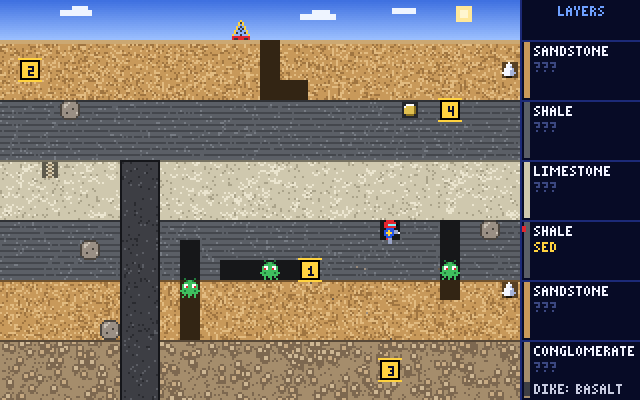

# Rock Driller

A tunnel-drilling Earth-science arcade game for **SpiderBen10's Arcade** (grades K–12, North
Carolina Standard Course of Study). Created by **SpiderBen10 (NZDO)**.



The arcade hero drills tunnels through a cross-section of the ground. Every layer is a **real,
labelled Earth material** (topsoil, sandstone, shale, limestone, granite, schist, the mantle,
even the liquid outer core) painted with its own colour and texture, and named in the legend on
the right.

- **Gems are question stations.** Fossils, crystals, ores, fossil fuels and living things are
  buried in the layers where they really occur (trilobites in Paleozoic limestone, diamonds in the
  mantle, oil in the reservoir sandstone). Drill into one and a science question pops up
  (`QuestionDeck(grade, "science", { gameId: "rock-driller" })`). Answer right to collect it;
  a wrong answer cracks it. A specimen card then teaches a fact about it.
- **Each level has a goal**, such as *Collect 3 fossils*, *Collect 3 gems from sedimentary
  rock*, *Collect 3 fossil fuels* or *Collect 3 Mesozoic fossils*. Gems that don't match
  still score points, and the card says why they don't count ("Granite is igneous rock…"). If
  too many target gems crack, a new one appears, so a goal can always be finished.
- **Field challenges** (twice a level) ask about the ground on screen: *Which marked layer is the
  OLDEST?* Numbered markers 1–4 appear in four layers. Answer by **drilling into a marker**,
  pressing **1–4 / A–D**, or **tapping** a choice in the mission strip. The questions are
  generated from the level's own layers, so the answer always matches the picture.
- The legend shows each layer's rock class (SED / IGN / MET / SOIL) once you uncover it by
  collecting a gem there or answering a challenge about it (grades 3–12).
- **Critters** roam the tunnels. Burrowbugs chase you and, when cut off, drift through rock as
  glowing eyes. From level 2 (grades 3+), Magmites also puff a short flame along a tunnel. The
  **foam blaster** traps a critter in bubbles, and more zaps pop it. Its foam goes down if you stop.
- **Boulders** wobble and fall when you dig out the tile under them. They crush every critter
  below them (500, 1000, 2000… points) and they crush you too.
- Finish the goal for an **incoming transmission**: a checkpoint science question with its
  explanation. A right answer gives +1000 × level and an extra life (up to 5).
- When the last life is lost, the **mission report** lists every NC standard practised (gems,
  field challenges and transmissions), the specimens collected, and what to **practise next**.

## Grade by grade

Field-challenge topics and codes come from this game. Gem and transmission questions come from
the kit's science bank for the grade, and each question shows its own code.

| Grade | Sites (levels cycle) | Goals | Field challenges | NC codes (challenges) |
|---|---|---|---|---|
| K | Backyard, River Bank, Rocky Hill | living things, crystals | Which layer is soil? deepest? closest to the top? sand? hardest? | PS.K.1.1 |
| 1 | same | + fossils | + sticky clay that holds water | ESS.1.2.1 |
| 2 | same (River Bank first) | living, fossils, crystals | same as grade 1 | ESS.1.2.1 † |
| 3 | Farm Field (soil profile), Canyon Mesa, Coal Hills, Mountain Roots | sedimentary / igneous / metamorphic gems, fossils, crystals | Most humus? Where do roots grow? Subsoil? Solid bedrock? | LS.3.3 † |
| 4 | Canyon Mesa, Mountain Roots, Farm Field, Coal Hills | same | Which marked layer is igneous / sedimentary / metamorphic? Most likely to hold fossils? Which is soil (weathering)? | ESS.4.2.2, LS.4.2.2, ESS.4.2.3 |
| 5 | same as grade 4 | same | same as grade 4 (review) | ESS.4.2.2, LS.4.2.2, ESS.4.2.3 † |
| 6 | Continent Root, Whole Earth, Ocean Floor, Fossil Cliff | same | Rock cycle (cooled magma / pressed sediment / heat and pressure), Earth's layers (liquid outer core, crust, hottest, asthenosphere), mantle, pillow basalt, soil formation | ESS.6.2, ESS.6.3 |
| 7 | Fossil Cliff, Continent Root, Ocean Floor, Whole Earth | same | Law of superposition (oldest / youngest), rock cycle and Earth's layers as review | ESS.8.1 †, ESS.6.2 |
| 8 | Fossil Cliff (with a basalt dike), Continent Root, Whole Earth, Ocean Floor | same | Superposition, cross-cutting (the dike formed last; layers on top of the dike are younger) | ESS.8.1, ESS.6.2 |
| 9 (Earth & Env. Sci.) | Oil Field, Geologic Time, Ore Hills, Ocean Floor | fossil fuels, ores, rock classes, crystals | Rock cycle, oil trap (cap rock, source rock), coal, iron ore, cement, relative dating, mantle | ESS.EES.2, ESS.EES.5 † |
| 10 (Biology) | Geologic Time, Fossil Cliff, Oil Field, Whole Earth | Cenozoic / Mesozoic / Paleozoic fossils, fossils, crystals | Index fossils and eras (which layer is Mesozoic?), oldest fossils (fossil record) | LS.Bio.6 †, review ESS.EES.2/5 |
| 11 (Chemistry) | Geologic Time, Ore Hills, Oil Field, Whole Earth | fossil fuels, ores, era fossils, crystals | Radiometric dating: "Half-life = 100 My. Which sample is 300 My old?" (samples show 1/2, 1/4, 1/8… left) | PS.Chm.1.2, review ESS.EES.2/5 |
| 12 (Physics) | Whole Earth, Geologic Time, Oil Field, Ocean Floor | same | S waves can't cross liquid (outer core), densest layer, half-life review | PS.Phy.7 †, review |

† = code to verify (see below).

**Difficulty.** K–2 get 2–3 slow critters, no fire critters, slower boulders with a longer
wobble, a longer foam reach, 2 zaps to pop, larger text and read-aloud on by default. Critters get
faster and more numerous with grade band and level. In grades K–5, critters slow down while a
field challenge is open. Goals grow from 2 or 3 gems up to 5.

### Geology the game gets right (checked by `npm test`)
- Rock classes: sandstone, shale, limestone, coal, conglomerate, oil sandstone and banded iron are
  sedimentary. Granite, basalt, pillow basalt, gabbro and peridotite are igneous. Marble (from
  limestone), slate and schist (from shale) and gneiss are metamorphic. Topsoil, subsoil and
  weathered rock are soil. Sand, clay, pebbles and mud are loose sediment.
- Fossils occur only in sedimentary rock and sediment, and living things only in topsoil. Fossil
  fuels occur only in sedimentary rock, and diamonds only in the mantle.
- Index fossils are always in the right era: trilobites, crinoids, brachiopods and seed ferns
  are Paleozoic, ammonites and dinosaurs Mesozoic, mammoths Cenozoic. They are never out of order
  top to bottom. Dated layers get older with depth, and their ages fall in their era (Cenozoic
  0–66 Ma, Mesozoic 66–252, Paleozoic 252–539).
- Earth's layers are in order: crust, upper mantle, lower mantle, liquid outer core, solid inner
  core. The oil trap has shale cap rock directly on the reservoir, with the source shale below.
- Every generated field challenge is re-solved independently: superposition (only undisturbed
  sedimentary layers), cross-cutting, rock classes, eras from ages, and half-life arithmetic
  (deeper samples have less parent isotope left).

**Simplifications.** The "Whole Earth" site is marked *not to scale*. Half-life challenges use
round teaching half-lives (50 or 100 million years), not a named isotope. Site names are
generic, not real places.

## Controls

| | Keyboard | Touch (iPad / phone) |
|---|---|---|
| Drill / move | `←` `→` `↑` `↓` | ◀ ▶ ▲ ▼ pad |
| Foam blaster | `Space`, `Z` or `X` (hold to keep pumping) | `FOAM` |
| Answer a gem question or transmission | `1`–`4` or `A`–`D`, then `Enter` | tap |
| Answer a field challenge | drill into marker 1–4, or `1`–`4` / `A`–`D` | drill into a marker or tap a choice |
| Read aloud again | `R` | speaker button |
| Pause / mute | `P` or `Esc` / `M` | toolbar |

A–D are never movement keys. The toolbar has **◀ ARCADE** (back to the arcade menu, keeping the
grade), pause, sound and read-aloud toggles. Opened from the arcade with `?grade=`, the title
shows the grade and a *Change grade in the arcade* link. Opened directly, it shows a K–12 picker.

## Presentation

The game uses a 320×200 logical canvas scaled up with nearest-neighbour, with CRT scanlines. The
ground is 26×18 tiles of 10 px under a sky row, beside a 60-pixel layer legend. Every sprite is a
character grid in code: the arcade hero, Burrowbugs, Magmites, boulders and 19 specimen shapes.
Layer names, markers and banners use a built-in 3×5 bitmap font (`src/drill/font.ts`), so they
stay crisp without the web fonts. Sound uses the kit's `ChipAudio` with Rock Driller's own
16-step bassline.

## Code map

| Path | What |
|---|---|
| `src/RockDriller.tsx` | React shell: title and grade, HUD, mission strip, gem and transmission panels, report, toolbar, touch pad, screen fitting |
| `src/drill/geology.ts` | Rocks, specimens, sites and the grade → site lists |
| `src/drill/levels.ts` | Level builder: layers, dike, gems, boulders, critter tunnels, goals |
| `src/drill/challenges.ts` | Field-challenge generators, grade topics and NC tags |
| `src/drill/engine.ts` | Game loop, drilling, critters, foam, boulders, challenges, drawing |
| `src/drill/ground.ts` | Rock textures, tunnels, legend layout |
| `src/drill/sprites.ts`, `font.ts` | Pixel sprites and the bitmap font |
| `src/kit/` | Shared arcade kit (unchanged copy) |
| `scripts/check-geology.ts` | Content tests (`npm test`) |
| `scripts/playtest.cjs` | Playwright playtest (needs a running preview server) |

## Run it locally

```sh
npm install
npm run dev        # http://localhost:8080
npm test           # geology, level and challenge checks for every grade
npm run build      # type-check + production build into dist/
```

`?debug` on the URL exposes `window.__rockDriller.engine` for automated playtests
(`debugTeleport`, `debugChallenge`, `debugFinishGoal`, `godMode`).
Playtest: `npx vite preview --port 4402 --host 127.0.0.1` then `node scripts/playtest.cjs`.

## Deploying

Rock Driller lives in SpiderBen10's Arcade repository (`games/rock-driller/`). The arcade's deploy workflow
builds and tests it and publishes it at `/rock-driller/` on the arcade's Azure app, so it needs no Azure
app or token of its own. See the arcade README.

## NC standard codes to verify

The official NC DPI site was blocked while this was written. The codes follow the kit's science
bank (`src/kit/banks/science/NOTES.md`) and should be checked:

- **ESS.1.2.1** is also used at **grade 2**, as review. Grade 2 has no Earth-materials standard.
- **LS.3.3** (soil layers, humus): this is the kit's code for soil. Soil might instead sit under LS.3.2 or ESS.3.2.
- **Grade 5** reviews the grade-4 codes **ESS.4.2.2 / ESS.4.2.3 / LS.4.2.2**. Grade 5 has no rocks standard.
- **ESS.6.2** is used for both the rock cycle and Earth's layers. The objective numbers are uncertain. **ESS.6.3** is used for soil formation.
- **ESS.8.1** (superposition) is used at **grade 7** as a preview. Grade 7 science has no geology.
- **ESS.EES.2** is used for rock cycle, Earth's structure and relative dating, and **ESS.EES.5** for energy and mineral resources. The kit's EES numbering beyond EES.2.2 is unverified.
- **LS.Bio.6** (fossil record, index fossils) is assumed, as in the kit.
- **PS.Phy.7** (seismic S waves) is assumed to be the waves standard, as in the kit.
- **PS.Chm.1.2** (half-life) and **ESS.8.1** at grade 8 were confirmed in search excerpts, per the kit notes.

---

Rock Driller was created by SpiderBen10 (NZDO) for SpiderBen10's Arcade.
