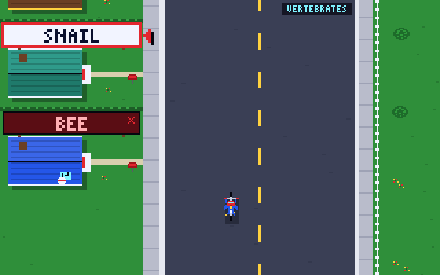

# Route Runner

A *Paperboy*-style delivery arcade game for **SpiderBen10's Arcade**, created by **SpiderBen10 (NZDO)**.
The SpiderBen10 hero rides his bike up a suburban street, dodging hazards and throwing packets
at houses. The twist: **every street has a delivery rule** from science, math or ELA
(NC Standard Course of Study, grades K–12).



- Each street shows a rule such as **Deliver to PRODUCERS**, **Deliver to CONDUCTORS**,
  **Deliver to PRIME numbers** or **Deliver to PAST-TENSE verbs**. Every house has a sign with a short label (a word, a number or an expression).
- Deliver to a matching house: **+100** (times your streak multiplier, up to ×5).
  Deliver to one that doesn't match and the subscriber **cancels**. The banner explains why it doesn't match.
  Skipping a non-matching house is a **good skip (+25)**. Riding past a matching house counts as **missed**.
- **Aiming is never the hard part.** The house in reach flashes, and SPACE (or THROW) sends a homing packet to it. You can also tap or click **any** house on screen to throw at it.
- Hazards (all original): traffic cones, rolling tires, sprinklers that switch on and off, and dogs that chase you for a moment.
  Hitting one costs a bike. You have 3 bikes, and a perfect street earns another, up to 5.
- Packets are limited: 10 to start (12 for K–2), max 20. Ride over **packet bundles** on the road for +5.
- **Bonus yard (the checkpoint):** each street ends in a yard with four targets, **A–D**, and a question from the kit's
  `QuestionDeck`. Press **A–D / 1–4**, tap a target, or tap an answer in the banner to throw. You always see the explanation.
  A right answer gives +500 × your multiplier and +6 packets. A wrong one gives +3 packets.
- At game over, a **mission report** lists results by NC standard (code and skill), covering both deliveries and yard questions, plus what to **practice next**.

## Subjects and grades

The title screen offers **Science** (first), **Math**, **ELA** or **Mixed** (Mixed rotates science → math → ELA streets).
Opened from the arcade with `?grade=`, the game shows the grade and a "CHANGE GRADE IN THE ARCADE" link.
Opened directly, it shows a K–12 picker. Bonus-yard questions come from the shared kit (`src/kit`, imported as `@/kit`).

| Grade | What changes |
|---|---|
| K–2 | 8 houses per street, slowest street, fewest hazards (dogs and tires are slow, short sprinkler sprays), 12 packets. **Read-aloud on by default**: the rule is read at the start of each street, each house label is read as it comes into reach, and cancellations and yard questions are read too |
| 3–5 | 10 houses, faster, more hazards |
| 6–8 | 12 houses, faster again |
| 9–12 | 12 houses, fastest. Every band speeds up and adds hazards on each new street |

### Delivery rules by grade (NC codes)

Every rule has at least 8 matching and 8 non-matching labels (97 rules, 1,753 labels in all).

| Grade | Science | Math | ELA |
|---|---|---|---|
| K | Living things (LS.K.1.1), Animals that fly (LS.K.2.1), Soft things (PS.K.1.1) | Less than 10 (NC.K.CC.7), Makes 5 (NC.K.OA.3) | Rhymes with CAT (RF.K.2), Color words (L.K.5), Starts with B (RF.K.3) |
| 1 | Living things, Plants (LS.1.1), Plant parts (LS.1.1), Animal homes (LS.1.2) | Makes 10 (NC.1.OA.6), 4 tens (NC.1.NBT.2) | Past tense (L.1.1), SH words (RF.1.3), Fruits (L.1.5) |
| 2 | Animal homes, Solids (PS.2.1.1), Melts on a hot day (PS.2.1.1), Hatch from eggs (LS.2.1) | Even numbers (NC.2.OA.3), 3 hundreds (NC.2.NBT.1) | Past tense, Plural nouns (L.2.1), Compound words (L.2.4) |
| 3 | Solids, Gases (PS.3.1.2), Bones (LS.3.1.1), Vertebrates (LS.3.1.1) | Multiples of 4, Equals 24 (NC.3.OA.7) | Compound words, Adjectives, Adverbs (L.3.1) |
| 4 | Vertebrates, Conductors (PS.4.2), Magnetic (PS.4.1.1), Minerals (ESS.4.2.1) | Primes, Multiples of 6 (NC.4.OA.4), Equal to 1/2 (NC.4.NF.1) | Adverbs, Synonyms of HAPPY (L.4.5), Prepositions (L.4.1), Onomatopoeia (L.5.5) |
| 5 | Producers (LS.5.2), Decomposers (LS.5.2.1), Inherited traits (LS.5.3) | Primes, More than 0.5, Worth 1/2 (NC.5.NBT.3) | Prepositions, Conjunctions, Interjections (L.5.1), Onomatopoeia (L.5.5) |
| 6 | Heat insulators (PS.6.2.3), Abiotic (LS.6.2), Floats in water (PS.6.1.3), Tundra (LS.6.2), Igneous rocks (ESS.6.2) | Integers (NC.6.NS.6), More than −3 (NC.6.NS.7), Equal to 25% (NC.6.RP.3) | Pronouns (L.6.1), Synonyms of ANGRY (L.6.5) |
| 7 | Igneous rocks, Eukaryotes (LS.7.1), Digestive system (LS.7.1), Units of speed (PS.7.1) | 25%, Negative products/quotients, Repeating decimals (NC.7.NS.2) | Synonyms of ANGRY, Prefix = NOT, Root SCRIB/SCRIPT (L.7.4) |
| 8 | Elements, Compounds, Chemical changes (PS.8.1), Renewable (PS.8.2), Sedimentary (ESS.8.1) | Perfect squares (NC.8.EE.2), Irrational (NC.8.NS.1) | Root SCRIB, Root PHON (L.8.4), Synonyms of BRAVE (L.8.5) |
| 9 (EES / Math 1 / English I) | Renewable, Metamorphic (ESS.EES.2), Greenhouse gases (ESS.EES.4) | Functions (NC.M1.F-IF.1), Linear (NC.M1.F-LE.1) | Root GRAPH/GRAM (L.9-10.4), Alliteration (L.9-10.5) |
| 10 (Biology / Math 2 / English II) | Organelles, Prokaryotes (LS.Bio.1) | Equal to 8, rational exponents (NC.M2.N-RN.2), Solved by x = 3 (NC.M2.A-REI.4) | Personification (L.9-10.5), Root LOG (L.9-10.4) |
| 11 (Chemistry / Math 3 / English III) | Ionic compounds (PS.Chm.3), Metals (PS.Chm.2) | Even functions (NC.M3.F-BF.3), Logs equal to 2 (NC.M3.F-LE.4) | Personification, Root VID/VIS (L.11-12.4), Means VERBOSE (L.11-12.5) |
| 12 (Physics / Math 4 / English IV) | Longer than visible light, Mechanical waves (PS.Phy.7), Contact forces (PS.Phy.2), Vectors (PS.Phy.1) | Sine positive (NC.M3.F-TF.2), Odd functions (NC.M3.F-BF.3) | Root VID/VIS, Means VERBOSE, Root CRED (L.11-12.4) |

Rules live in `src/route/rules/` (`science.ts`, `math.ts`, `ela.ts`). Math labels are **computed**:
`src/route/rules/expr.ts` parses each label (`3/6`, `2{3}`, `log[2]4`, `x{2}+y{2}=9`, `sin 150°`…) and each math rule's
`test` classifies it. `npm test` (`scripts/check-rules.ts`) checks the following for every grade:
- the hand-sorted lists agree with the computation
- each rule has ≥ 8/8 labels, with no duplicates and no overlaps
- labels are ≤ 10 characters and the bitmap font can draw them
- every label has an explanation
- the codes are well formed
- every grade/subject has ≥ 2 rules
- streets plan correctly

### Codes to verify
The NC DPI site was blocked while this was built, so these codes are best guesses:
- **LS.K.2.1** for "animals that fly": the kit uses it for "same kind of animal, alike and different".
- **LS.1.1 / LS.1.2** split between plants and animals. **LS.3.1.1** is used for vertebrates (as skeletons with a backbone).
- **ESS.6.2** for igneous rocks: the rock cycle may sit under a different grade-6 objective. **ESS.8.1** for sedimentary rocks (rock layers).
- **ESS.EES.2** (rock cycle), **ESS.EES.4** (greenhouse gases), **PS.Chm.2 / PS.Chm.3**, **PS.Phy.1 / .2 / .7**: the numbering follows the kit's own unverified notes.
- **L.5.5** for onomatopoeia and **L.9-10.5** for alliteration. Sound devices may be filed under RL.x.4 instead.
- Math: **NC.K.CC.7** (the rule uses numbers to 20), **NC.6.NS.6** (integers), **NC.M3.F-BF.3** (even/odd functions, also used for grade 12),
  **NC.M3.F-TF.2** (unit circle, used for grade 12), **NC.M2.A-REI.4** (checking solutions).

## Controls

| Keyboard | Touch | Action |
|---|---|---|
| ← / → | ◀ ▶ | Steer |
| ↑ / ↓ (hold) | FAST / SLOW | Speed up / brake |
| Space / Z / X | THROW, or tap any house | Throw a packet at the flashing house |
| A–D or 1–4 | tap a target or a banner answer | Bonus-yard answer |
| Enter / Space | Next street ▶ | Continue after the bonus yard |
| R | speaker button | Read the rule / question aloud again |
| P / Esc, M | toolbar | Pause, mute |

A–D are never movement keys. The toolbar has **◀ ARCADE** (keeps the grade), plus sound and read-aloud toggles.

## Run it locally

```sh
npm install
npm run dev        # http://localhost:8080
npm test           # validate every delivery rule, K–12
npm run build      # type-check + production build into dist/
```

Playtest (Playwright, optional): run `npm run build && npx vite preview --port 4405 --host 127.0.0.1`, then `node scripts/playtest.cjs`.
Add `?debug` to the URL to expose the engine as `window.__routeRunner`.

## Deploying

Route Runner lives in SpiderBen10's Arcade repository (`games/route-runner/`). The arcade's deploy
workflow builds and tests it and publishes it at `/route-runner/` on the arcade's Azure app, so it
needs no Azure app or token of its own. See the arcade README.

## Credits

Game design and characters: **created by SpiderBen10 (NZDO)**. The hero, hazards and houses are original pixel art.
