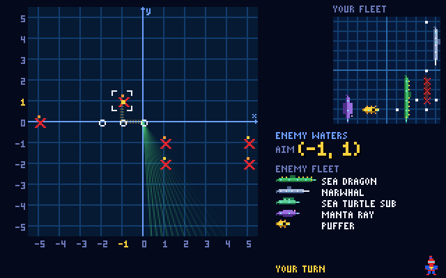

# Sonar Squad

A Battleship-style grid game for **SpiderBen10's Arcade**, created by **SpiderBen10 (NZDO)**.
Hide your fleet, then take turns firing torpedoes at the enemy's waters. **Calling a shot means
reading a coordinate**: picture rows and numbers in K–2, letter–number grids in grades 3–4, the
first quadrant in grade 5 and the full four-quadrant plane from grade 6. Every shot is armed by a
quick question, and harder questions earn power-ups. 80s sonar-screen look: a 320×200 canvas with
a sweeping scope, CRT scanlines, original pixel subs, splashes, explosions, sinking ships and a
chiptune bassline.



## How it plays

1. **Place your fleet** on a 10×10 board (11×11 crossings from grade 6): five original subs, the
   **Sea Dragon** (5), **Narwhal** (4), **Sea Turtle Sub** (3), **Manta Ray** (3) and **Puffer** (2).
   Tap or drag them, use the arrow keys + Space, **R** to rotate (tapping a placed ship turns it), or
   **AUTO**. The computer places its ships at random and never lets two touch.
2. **Every turn starts with a quick question** (a kit `QuestionDeck`, `quickOnly`, one grade below the
   player's grade; K stays K). Right: the torpedo is armed. Wrong: the explanation shows,
   **"Sonar jammed!"**, and the shot is lost. **K–2 get one retry** with a different question first.
3. **Aim and fire.** Tap a square/point (tap it again to fire), move with the arrow keys and press
   Space/Enter, or (grade 5+) type the ordered pair, e.g. `(3, −2)` + Enter. The banner, the FIRE
   button and the screen always show the spot being aimed at in the grade's notation, and the row and
   column (or the path from the axes on the coordinate plane) light up. Hits flash and burn, misses
   splash, and a sunk ship shows as a wreck.
4. **Power-ups.** The POWER meter charges once per turn and is full every **3 turns** (every 2 in K–2,
   which also start with it full: the "extra sonar"). Press **POWER-UP** (or **U**), pick one, and
   answer a **harder question** (the player's own grade, longer questions and passages allowed):
   - **Sonar sweep**: pick the middle of a 3×3 area; it shows CONTACT (and how many ship squares) or
     all-clear.
   - **Double shot**: two torpedoes this turn.
   - **Repair crew**: fixes the latest hit square on your most damaged ship still afloat; the enemy's
     mark there is wiped, so it has to find that square again.

   A wrong answer shows the explanation and spends the charge, but the normal turn continues.
5. **Coordinate challenges** now and then replace "anywhere" with a math target, for bonus points:
   K–4 *"Admiral's call: fire at Crab 4!" / "…at C7!"*; grade 5 *"Start at (1, 4). Move 3 right and 2
   up."*; grades 6–7 reflections over an axis, "4 units left of (−1, 2)", the 4th corner of a
   rectangle, "the point in Quadrant III 2 units from both axes"; grade 8 reflections, translations by
   a rule, 180° rotations; high school midpoints, 90° rotations about the origin and reflection over
   y = x. Firing at the right spot scores +250 (+300 from grade 5) and counts toward the coordinate
   skill in the report; otherwise the answer and the reason are shown.
6. **K–2 extras:** read-aloud on (questions, aim, results), bigger text, the power-up charges twice as
   fast and starts full, a second try on shot questions, and a **hint glow** over a 3×3 area that hides
   a ship after three misses in a row.
7. **Mission report** for each player: score, shots, hits, accuracy, ships sunk, jammed turns,
   power-ups earned, then **coordinate skills**, **shot questions** and **power-up questions**, each by
   NC standard (code + skill), and **practice next** (anything under 75%).

### Modes

- **1 player vs the computer.** Easy, Medium or Hard (see below). The default depends on the grade
  (K–5 Easy, 6–12 Medium); change it on the title screen or mid-game with the **CPU:** toolbar button.
  The computer does not answer questions and gets no power-ups.
- **2 players, pass and play** on one device. Both play at the arcade grade. Player 1 places, then a
  **"Pass to Player 2 — don't peek!"** cover screen, Player 2 places, then turns alternate with a cover
  screen before each one. Each player only ever sees their own fleet and their own shots grid, and
  answers their own questions. Answers are recorded under the same game id (`sonar-squad`); the report
  has a tab per player.

## Controls

| Action | Keyboard | Touch / mouse |
|---|---|---|
| Place a ship | arrows + **Space**/**Enter**; **R** rotate; **O** auto; **Backspace** undo; **Enter** ready | tap the water, drag a ship, tap a ship to turn it, ROTATE / AUTO / UNDO / READY |
| Aim | arrow keys | tap a square or point |
| Fire | **Space** or **Enter** | tap the aimed spot again, or FIRE |
| Type a point (grade 5+) | start typing `3, -2` (or `(3, −2)`) then **Enter** | the TYPE box |
| Answer a question | **1–4** or **A–D**, then **Enter** | tap an answer, then the button |
| Power-up | **U**, then **1–3** (Esc cancels) | POWER-UP, then tap a card |
| Sonar area | arrows + **Space** | tap the middle square twice, or PING |
| Read aloud again / pause / mute | **R** / **P** or **Esc** / **M** | speaker button / toolbar |

The letters **A–D** only ever answer questions. Grades 3–4 name rows with letters A–J, so those rows
are reached with the arrow keys or by tapping, never by pressing letter keys.

## Coordinates by grade

| Grade | Board | Spot names | Coordinate skill (report) |
|---|---|---|---|
| K–2 | 10×10 squares | 10 picture rows (fish, crab, star, shell, octopus, turtle, whale, duck, boat, anchor) × numbers 1–10: *Crab 4* | NC.K.G.1 positions (row and column) |
| 3 | 10×10 squares | rows A–J × columns 1–10: *C7* | 3.G.1 map grids (social studies) |
| 4 | 10×10 squares | rows A–J × columns 1–10: *C7* | 4.G.1 map grids (social studies) |
| 5 | 10×10 grid-line crossings | first quadrant, x and y from 0 to 9: *(3, 7)* | NC.5.G.1 |
| 6–8 | 11×11 crossings | all four quadrants, −5 to 5: *(3, −2)* | NC.6.NS.6, NC.6.NS.8, NC.6.G.3 (6–7); NC.8.G.3 (8) |
| 9–12 | 11×11 crossings | all four quadrants, −5 to 5 | NC.M1.G-GPE.6 (midpoint), NC.M2.G-CO.2 (rotations/reflections as functions), NC.8.G.3 |

| Challenge | Grades | Standard |
|---|---|---|
| Admiral's call (name a spot) | K–7 | K–2 NC.K.G.1 · 3 3.G.1 · 4 4.G.1 · 5 NC.5.G.1 · 6–7 NC.6.NS.6 |
| Start at a point, move right/up | 5 | NC.5.G.1 |
| Reflect over the x- or y-axis | 6–8 | NC.6.NS.6 (6–7), NC.8.G.3 (8) |
| *n* units left/right/up/down of a point | 6–7 | NC.6.NS.8 |
| 4th corner of a rectangle | 6–8 | NC.6.G.3 |
| Point in Quadrant *k*, *d* units from both axes | 6–7 | NC.6.NS.6 |
| Translate by a rule (x, y) → (x + a, y + b) | 8–12 | NC.8.G.3 |
| Rotate 180° about the origin | 8 | NC.8.G.3 |
| Rotate 90° counterclockwise about the origin; reflect over y = x | 9–12 | NC.M2.G-CO.2 |
| Midpoint of a segment | 9–12 | NC.M1.G-GPE.6 |

Questions (shot and power-up) come from the shared kit and carry their own NC codes: math is
generated and **adaptive** (the kit moves it up and down automatically), science, ELA and social studies
come from the written banks. The title screen picks **Math** (default), **Science**, **ELA**, **Social
studies** or **Mixed** (all four in turn).

### Codes to verify

The NC DPI site was not reachable from the build sandbox, so these were chosen from memory of the
2017 NC math standards and the 2021 NC social studies standards:

- **NC.K.G.1** (describe positions: above, below, beside, next to…) is used for the K–2 picture grid.
  NC has no K–2 standard about grids; this is the closest fit.
- **3.G.1 / 4.G.1** (social studies, geography: using maps and their tools) for the grade 3–4
  letter–number grid, at the standard level because the objective (3.G.1.x / 4.G.1.x) could not be
  confirmed. NC math has no grid/coordinate standard in grades 3–4.
- **NC.5.G.1** (graph and identify points in the first quadrant) is used for all grade 5 coordinate
  work. Common Core's 5.G.2 does not appear to exist as a separate NC code, so it is not used.
- **NC.6.NS.6** (rational numbers as points on a line and as ordered pairs; signs and reflections across
  the axes) for four-quadrant points, quadrants and axis reflections. **NC.6.NS.8** (graph points in all
  four quadrants; distances between points with the same first or second coordinate) for "n units
  left/right of". **NC.6.G.3** (polygons in the coordinate plane from vertex coordinates) for the
  rectangle corner. These three look right but are worth a check.
- **NC.8.G.3** (effects of dilations, translations, rotations and reflections using coordinates).
- **NC.M1.G-GPE.6** (midpoint or endpoint of a segment, NC Math 1) and **NC.M2.G-CO.2** (transformations
  as functions of the coordinates, NC Math 2) are the least certain.

## Computer opponents

The AI is pure functions of what the shooter can see (`src/sonar/ai.ts`):

- **Easy**: random spots, never the same one twice.
- **Medium** ("hunt and target"): random until it hits, then the four neighbours of the hit; once two
  hits line up it follows the line from both ends until the ship sinks.
- **Hard** ("probability map"): for every remaining ship and every way it could still lie (avoiding
  misses and sunk ships), adds up how many placements cover each open spot, weighting placements
  through unsunk hits heavily; fires at the maximum.

`npm test` simulates full games through the real rules engine and checks that no level ever fires
off the board or twice at a spot. Results with `SIMS=2000` (who shoots first alternates):

| Matchup | First player wins |
|---|---|
| Hard vs Easy | 100% (10×10 and 11×11) |
| Hard vs Medium | 84% |
| Medium vs Easy | 99% |
| Simulated kid (hunt-and-target aim, ~20% of shots jammed) vs Easy / Medium / Hard | 82% / 24% / 5% |
| …same kid also using a double shot every 3 turns (earned 75% of the time) vs Easy / Medium / Hard | 99% / 50% / 18% |
| K–2 kid (one retry, ~4% jammed) with random aim / with hunt-and-target aim, vs Easy | 26% / 97% |
| Beginner with random aim, ~20% jammed, vs Easy | 1% |

Average shots to sink a whole fleet: Easy 96, Medium 62, Hard 45 (10×10). So the defaults are
**Easy for K–5** and **Medium for 6–12**: a kid who misses some easy questions but follows up on hits
and uses power-ups has a fair (about even) game against Medium and usually beats Easy; Hard is for
kids who want a real challenge. A kid who fires completely at random will lose to any computer, which
is why K–2 also get the hint glow, extra sonar and a second try.

## Code layout

| File | What it does |
|---|---|
| `src/sonar/core.ts` | Fleet, boards, placement rules, shot resolution, seeded RNG (pure) |
| `src/sonar/match.ts` | The rules engine (`Match`) and the `Player` interface (pure) |
| `src/sonar/players.ts` | `LocalHumanPlayer` and `ComputerPlayer(level)` |
| `src/sonar/ai.ts` | Easy / Medium / Hard as pure functions |
| `src/sonar/notation.ts` | Grade → coordinate scheme; format/parse "Crab 4", "C7", "(3, −2)" (pure) |
| `src/sonar/challenge.ts` | Coordinate challenges and their standards (pure) |
| `src/sonar/game.ts` | Game controller: the screen side of human players, questions, power-ups, cover screens, stats |
| `src/sonar/render.ts`, `sprites.ts`, `font.ts` | The 320×200 canvas, pixel art, bitmap font |
| `src/SonarSquad.tsx`, `src/sonar/sonar.css` | React shell: toolbar, HUD, banner, overlays, controls, report |
| `scripts/check-game.ts` | `npm test`: notation, challenge math, placement, AI, rules engine, simulations |
| `scripts/playtest.cjs` | Playwright playtest (see the comment at the top) |

## Adding online play later

The rules engine (`Match` in `src/sonar/match.ts`) only talks to the two seats through the `Player`
interface:

```ts
interface Player {
  kind: "human" | "computer" | "remote";
  placeFleet(ctx): Promise<Placement[]>;
  takeAction(view: TurnView): Promise<TurnAction>; // fire at a spot, "jammed", or a power-up attempt
  notify?(ev: MatchEvent): void;                    // hit / miss / sunk / sonar / repair / game over
}
```

v1 seats are `LocalHumanPlayer` (the screen asks the questions and lets the kid aim; pass-and-play is
two of them sharing the screen plus the cover screen) and `ComputerPlayer(level)`. Online play (v2)
adds a **`RemotePlayer`** for the other device's seat: `takeAction` waits for that device's move from
the realtime service (e.g. Azure Web PubSub) and `notify` sends results back. The game screen and the
rules do not change.

For v2 the **server must be authoritative**: it holds **both fleets** and runs the `Match` itself
(the same `match.ts` code works in an Azure Function), so each browser only sends "fire at (3, −2)"
and receives "hit / miss / sunk". If each browser held its own fleet and reported its own hits, a
player could cheat by editing the page. Kid-safety rules from the plan apply: room codes for friends
and family only, no free-text chat (preset emotes), nicknames only, rooms expire.

## Running

```bash
npm install
npm run dev        # http://localhost:8080 (add ?grade=7 to start like the arcade does)
npm test           # content, AI and rules checks (SIMS=2000 for more simulated games)
npm run build      # tsc strict + vite build into dist/
```

Playtest: `npm run build && npx vite preview --port 4431 --host 127.0.0.1 &` then
`node scripts/playtest.cjs` (`SHOT=docs/screenshot.png` also saves a canvas screenshot). `?debug`
exposes the game controller as `window.__ss`; `?debug&fast` speeds up animations.

## Deploying

Sonar Squad lives in SpiderBen10's Arcade repository (`games/sonar-squad/`). The arcade's deploy workflow
builds and tests it and publishes it at `/sonar-squad/` on the arcade's Azure app, so it needs no Azure
app or token of its own. See the arcade README.

## Credits

Created by **SpiderBen10 (NZDO)** for SpiderBen10's Arcade. Original game, ships, art and music;
"Battleship" is a Hasbro trademark and is not used. Built with React, TypeScript and Vite.
