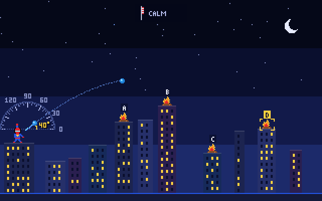

# Splash Arc

A turn-based **water-balloon artillery** game for SpiderBen10's Arcade (K–12). You set an
angle and a power and lob a water balloon over the rooftops, and the **geometry is how you aim**.
The idea comes from the *mechanic* of Gorillas (1991) and Scorched Earth. Everything here is original
and kid-safe: no gorillas, no bananas, no explosions, and nothing ever aims at people or animals. The targets
all need water: rooftop campfires (they fizz out), thirsty flowers and gardens (they bloom), bells (they ring),
paint targets, water tanks and containers (they fill up) and sun-baked dino egg statues (they cool down). The
thrower is the arcade's own hero with a water-balloon launcher.



## How it plays

- Each level has a row of buildings or hills (they never break), the hero's launcher on the left and
  **four targets, A–D**, on the roofs. Later levels have **wind**: watch the windsock.
- **Before every throw, answer one geometry question.** It either *picks your target* ("Fill the
  CYLINDER!", "the tank that holds 24 cubic units", "the fire at (7, 4)"), *sets your angle* ("aim at the
  supplement of 130°", "the ramp rises 7 m over 12 m"), sets *angle and speed* (projectile equation), or
  *checks the geometry* behind an angle that is already set. Answer with keys **1–4 / A–D** or by tapping;
  on "pick" questions you can also tap the target itself.
- **Right answer:** a **guide line** shows the start of the real arc (the whole arc for K–2), and every 3 in a
  row earns a **bonus balloon**. **Wrong answer:** the explanation and diagram appear, the launcher takes the
  value you chose, and you can still fix the aim and fire, so nobody gets stuck.
- Fine-tune and **FIRE**. A miss leaves a faint trail and says "too short / too far" (K–2 then get a "more or
  less power?" question).
- Between levels comes a **transmission**: a checkpoint math question from the kit's `QuestionDeck`
  (adaptive math, with its explanation). At the end, the **mission report** lists results by NC standard plus
  "practice next".
- **2 players:** pass-and-play on one device. Players take turns, each with their own balloons, score and report tab.
- K–2: bigger text, read-aloud on by default, slower flights, more balloons, no degrees (an arrow shows aim
  and power), and targets that are 2-D/3-D shapes.

## Physics

Uniform gravity plus a steady sideways wind acceleration, no drag. The scale is 1.6 px per meter and
g = 9.8 m/s² (Mars 3.7, Moon 1.6). Each step uses the exact constant-acceleration update with a fixed
1/120 s time step, so every simulated point lies exactly on x(t), y(t). The guide line and the real flight
come from the same `simulate()` call, so the guide always matches the throw. Power P (5–100) gives a
launch speed v = 0.5·P m/s on Earth (0.3·P on Mars, 0.2·P on the Moon, chosen so throws reach a similar
distance). Each level layout is checked when it is built: every target must be reachable by several
whole-number angles, each with a run of hitting powers.

## Controls

| | Keyboard | Touch / mouse |
|---|---|---|
| Angle | ← raise, → lower (Shift = 5°) | drag from the launcher (direction = angle, length = power), ◢/◤ buttons, angle slider |
| Power | ↑ / ↓ (Shift = 5) | drag length, − / + buttons, power slider |
| Fire | Space / Enter | FIRE button |
| Answer | 1–4 or A–D (never used for moving) | tap a choice (or tap the target for "pick" questions) |
| Other | P / Esc pause · M mute · R read aloud | toolbar buttons, speaker buttons |

## Geometry by grade (NC Standard Course of Study codes)

| Grade | Levels (targets) | Aiming questions | Codes |
|---|---|---|---|
| K | 3-D solids (cube crate, cylinder barrel, cone, sphere ball), 2-D shaped flowers, mixed flat/solid | Name the shape; flat (2-D) or solid (3-D); position words (just left/right of, highest/lowest); compare attributes (rolls, flat faces, sides, corners); more/less power after a miss | NC.K.G.1, NC.K.G.2, NC.K.G.3, NC.K.G.4, NC.K.MD.2 |
| 1 | Solids (+ rectangular prism), paint targets cut into halves/fourths, flowers | Defining attributes of 2-D and 3-D shapes; halves and fourths vs unequal parts; half/quarter/full turns; position; more/less | NC.1.G.1, NC.1.G.3, NC.K.G.1, NC.K.G.2, NC.K.MD.2 |
| 2 | Polyhedra (cube, prism, triangular prism, pyramid, cylinder), polygon flowers, paint targets | Faces, edges and vertices; triangle/quadrilateral/pentagon/hexagon by sides and angles; halves/thirds/fourths; quarter turns | NC.2.G.1, NC.2.G.3, NC.1.G.1, NC.K.G.1, NC.K.MD.2 |
| 3 | Quadrilateral signs, rooftop gardens (w × h) | Right angles, equal sides, parallel sides ("a rectangle AND a rhombus"); perimeter (and the missing side); area; launch angle vs a right angle | NC.3.G.1, NC.3.MD.8, NC.3.MD.7 |
| 4 | Campfires, bells, dino eggs | Read the on-screen protractor; acute/right/obtuse/straight (launch angle and the angle behind it); angle as a fraction of 360°; adding angles / straight angle; meters → centimeters | NC.4.MD.6, NC.4.G.1, NC.4.MD.5, NC.4.MD.7, NC.4.MD.1 |
| 5 | Grid levels: targets at (x, y) in quadrant I; water tanks | Splash the target at (x, y); coordinate word problems; tank volume V = l × w × h and additive (two-box) volume; counting unit cubes; m → km | NC.5.G.1, NC.5.G.2, NC.5.MD.5, NC.5.MD.4, NC.5.MD.1 |
| 6 | Grid levels: area signs (triangles, parallelograms, trapezoids, L-shapes), tanks with fractional edges, solids | Area of triangles and composite shapes; 4th corner of a rectangle and side lengths from coordinates; nets → solids; surface area from nets; volume with ½ edges | NC.6.G.1, NC.6.G.3, NC.6.G.4, NC.6.G.2 |
| 7 | Fires, eggs, bells, prism tanks (rectangular and triangular) | Complement/supplement; vertical and adjacent angles; angle equations (x + 2x + 33 = 90); scale drawings; cross-sections of solids; volume and surface area of prisms | NC.7.G.5, NC.7.G.1, NC.7.G.3, NC.7.G.6 |
| 8 | Fires, bells, eggs, cylinder/cone/sphere tanks | Pythagorean theorem (triples and non-triples to the tenth); distance between points; parallel lines cut by a transversal; triangle angle sum and exterior angles; reflecting a shot over a vertical wall; slope of the ramp; volume of cylinders, cones and spheres | NC.8.G.7, NC.8.G.8, NC.8.G.5, NC.8.G.3, NC.8.EE.6, NC.8.G.9 |
| 9–12 | Fires, bells, eggs, containers, and a **Mars** (9–11) or **Moon** (12) base | Right-triangle trig to the nearest degree (tan, sin, cos); parabola key features (vertex, zeros, axis); pick the (angle, speed) pair that passes through the target using y = x·tanθ − g·x²/(2v²cos²θ) (calm levels, real g); volume formulas incl. pyramids; Cavalieri's principle; solids of rotation and cross-sections; density | NC.M1.F-IF.4, NC.M1.F-IF.7, NC.M2.G-SRT.8, NC.M2.F-IF.4, NC.M3.G-GMD.1, NC.M3.G-GMD.3, NC.M3.G-GMD.4, NC.M3.G-MG.2 |

Grade 9 gets the NC Math 1 items and volume, grade 10 adds trig and the projectile pair, and grades 11–12 get everything.
Transmissions between levels are kit math at the player's grade (adaptive ±2 grades).

### Codes to verify

These tags are my best match. Please check them against the NC DPI documents (the site is blocked in this sandbox):

- **NC.1.G.3 / NC.2.G.3 for half/quarter turns**: these standards cover partitioning into halves/fourths/thirds; turns
  are used as "parts of a whole turn". There may be a better code.
- **NC.3.G.1 for "launch angle vs a right angle"**: right angles as attributes of quadrilaterals.
- **NC.4.G.1 for classifying acute/right/obtuse/straight**: NC.4.G.1 is "draw and identify… angles"
  (search confirmed); classifying by measure may sit under NC.4.MD.5/6 instead.
- **NC.8.EE.6** for ramp slope (similar triangles and slope).
- **NC.M2.F-IF.4** for the projectile (angle, speed) question; the brief suggested M1/M2/M3 F-IF codes.
- **NC.M3.G-GMD.1, G-GMD.3, G-MG.2**. NC.M3.G-GMD.4 (cross-sections, rotations) was confirmed by search.
- **Triangle angle sum** is tagged NC.8.G.5 (grade 8). Grade 7 instead uses angle equations (NC.7.G.5).
- **K–2 "more or less power"** uses NC.K.MD.2 at every K–2 grade.

## Tests

`npm test` (`scripts/check-game.ts`, about 97,000 checks):

- **Physics:** the simulated range matches v²·sin2θ/g on flat ground on all three planets; every step lies on the
  exact trajectory (also with wind); the trajectory equation matches; wind moves the landing downwind and
  leaves the flight time at 2v·sinθ/g; the guide arc is an exact prefix of the flight.
- **Levels:** every level at every grade (3 seeds each) is solvable. A known whole-number angle and power hits each
  target. Targets sit on roofs and on screen, never overlap, run A–D left to right, and match their grid
  coordinates.
- **Questions:** 36 per level, for every level, grade and seed (about 6,700). Each has 4 distinct choices and exactly
  one correct answer, and that answer is recomputed independently: angle relationships, parallel-line spots,
  triangle sums, reflections, trig to the nearest degree, Pythagorean triples and non-triples, distance, slope,
  parabola vertex/zeros, Cavalieri, density, areas (shoelace formula), volumes (numerical slicing), surface
  areas (face by face), faces/edges/vertices from vertex lists (and Euler), and cross-sections (by cutting the
  solids). It also checks that the correct angle or (angle, speed) pair hits in the simulator and that wrong pairs miss.
  Further checks: text length limits, no NaN/undefined or long decimals, and NC codes valid for the grade band.
  Every generator gets exercised. Kit math is also drawn for every grade.

`scripts/playtest.cjs` (Playwright; needs `npx vite preview --port 4646 --host 127.0.0.1`) plays whole games at
grades K, 3, 4, 7 and 11 on 1280×800 keyboard, iPad 1080×810 touch and iPad 810×1080 touch. It also runs one
pass-and-play game and the grade picker. It checks answers by key, tap and canvas tap, a wrong answer's explanation,
the guide line matching the flight, drag aiming, wind, transmissions by key and tap, the report, page errors,
scrolling and viewport fit. `?debug` exposes the game as `window.__sa` and `&fast` speeds up flights.

## Run it

```bash
npm install
npm run dev        # http://localhost:8080
npm test
npm run build      # tsc strict + vite build → dist/
```

## Deploying

Splash Arc lives in SpiderBen10's Arcade repository (`games/splash-arc/`). The arcade's deploy workflow
builds and tests it and publishes it at `/splash-arc/` on the arcade's Azure app, so it needs no Azure
app or token of its own. See the arcade README.

## Credits

Created by SpiderBen10 (NZDO). Original pixel art, music and characters. The shared arcade kit is in `src/kit` (do not edit it here).
