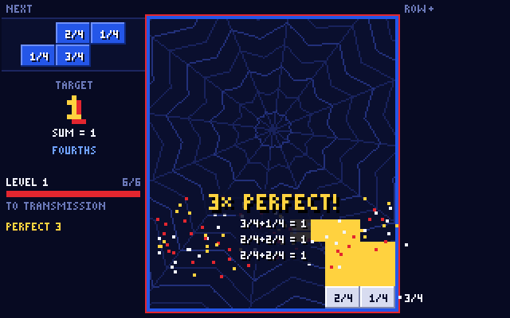

# Sum Stack

A falling-block math arcade game for **SpiderBen10's Arcade** (grades K–12, North Carolina
Standard Course of Study). Created by **SpiderBen10 (NZDO)**.



Blocks fall into a 7-wide well, just like the classic, but **every block carries a number**.
The HUD shows a **target** (`MAKE 10`, `PRODUCT = 24`, `SUM = 1`, `x = 3 · SUM = 14`).

- A **full row** clears as usual.
- A row whose numbers combine **exactly** to the target clears the moment it is made, even
  if it isn't full: a **PERFECT ROW**. It scores 400 × level, counts as two lines, and
  flashes its equation (`3+2+5 = 10`). Perfect rows on back-to-back pieces build a
  **COMBO** multiplier (up to ×5).
- The **running total** of every row is shown to the right of the well. It turns red and says
  **OVER** when a row can no longer hit the target, so you have to fill it instead.
- A ghost outline shows where the piece will land. The **NEXT** box shows the next piece's
  numbers so you can plan ahead.
- Each level has a goal (5 lines for K–2, 6 for grades 3–12). Reaching it brings an **incoming
  transmission**: a multiple-choice math question from the arcade kit
  (`QuestionDeck(grade, "math", { gameId: "sum-stack" })`) with an explanation. A right
  answer earns a power-up:
  - **ROW BLAST** clears the bottom two rows (always chosen when the stack is tall).
  - **SLOW-MO** makes blocks fall slower for 45 seconds.
  - **WILD ? CELL** puts a `?` block in your next piece. It becomes exactly the number its
    row needs (the missing addend or factor).
- Each new level brings a new target and faster gravity. The game ends when the stack reaches
  the top. The **mission report** lists every NC standard practiced, with perfect and full rows
  and checkpoint results.

### Always solvable

Numbers are not random noise. Each rule has a fixed set of cell values, and targets are only
chosen when those values can make them exactly. Pieces are dealt from a queue filled with whole
"partitions" of the target: sets of 2–4 values that combine exactly to it. About half the pieces
(65% for K–2) also carry a **fixer**: the exact value one of the three highest open rows still
needs. All arithmetic uses exact rationals, so `0.1 + 0.2` really is `0.3` and `1/3 + 1/6`
really is `1/2`.

## Grade rules

| Grade | Row rule | Cell values | Target | NC standard |
|---|---|---|---|---|
| K | add, `MAKE n` | 0–5 (drawn double size) | 6, 8, then 10 (some 7–9) | NC.K.OA.3 (break apart numbers to 10), NC.K.OA.4 (make 10) |
| 1 | add | 1–9 | 10–20 | NC.1.OA.6 |
| 2 | add | fives and tens (levels 1–2), then 4–45 | 40–80, then 50–99 | NC.2.NBT.5 |
| 3 | **multiply**, `PRODUCT = n` | factors of the target (and 1) | 12–72 | NC.3.OA.7 |
| 4 | add fractions, like denominators (`FOURTHS`, `THIRDS`…) | k/d | 1, then 2 | NC.4.NF.3 |
| 5 | odd levels: unlike denominators (halves + fourths, thirds + sixths…) · even levels: decimals (tenths, then hundredths) | fractions in lowest terms · 0.1–1.5 | 1, then 2–3 | NC.5.NF.1 · NC.5.NBT.7 |
| 6 | odd levels: multi-digit decimals · even levels: positive and negative integers | 0.1–4.6 · −9…9 | 4–7 · −8…10 | NC.6.NS.3 · NC.6.NS.5 |
| 7 | odd levels: integers · even levels: signed fractions and decimals (−3/4, 0.5, −1.5…) | −12…12 · ±½, ±¼, ±¾, ±1½… | 0 first, then −10…10 · 0, ±1, ±½, 2 | NC.7.NS.1 |
| 8 | expressions at a shown `x` (`x = 3`) | `2x`, `x+1`, `5−x`, `−x`, `x²`, `x²−1`, `x⁰`, `x³`… | −30…30 | NC.8.EE.1 |
| 9 (NC Math 1) | function values, `f(x)=2x+1` shown | `f(−3)` … `f(4)` | −30…30 | NC.M1.F-IF.2 |
| 10 (NC Math 2) | odd levels: quadratic `f(x)=x²−2x`… · even levels: roots and rational exponents | `f(k)` · `√49`, `∛27`, `8^(2/3)`, `2³`… | −30…30 · 6–20 | NC.M2.F-IF.2 · NC.M2.N-RN.2 |
| 11 (NC Math 3) | logarithms | `log₂8`, `log₃81`, `log100`… | 4–12 | NC.M3.F-LE.4 |
| 12 (NC Math 4) | odd levels: logs with fraction values (`log₄2 = ½`, `log₈4 = ⅔`) · even levels: negative and fraction exponents (`2⁻¹`, `16^(1/4)`) | exact rationals | 2–4 · 4–10 | NC.M3.F-LE.4 · NC.M2.N-RN.2 |

Grade 12 reviews NC Math 2–3 content, because those codes are the ones we are confident of.
Checkpoint questions come from the shared kit's grade-level generator.

Grade comes from `?grade=` on the arcade link (kit `initialGrade()`), then the last grade
used. The title screen has a K–12 picker, with the grade preselected, and shows the rule plus
a worked example. For **K–2**, gravity is slower, lock delay is longer, numbers are drawn double
size, and **read-aloud is on by default**. The rule is read at each level, and so are the
checkpoint question with its choices and every perfect-row equation ("3 plus 2 plus 5 equals
10!"). The checkpoint also has a *Read it to me* button, and the toolbar has a toggle
(saved with the kit's `setReadAloudPref`).

## Controls

| | Keyboard | Touch (iPad / phone) |
|---|---|---|
| Move | `←` `→` (hold to slide) | `◀` `▶` |
| Rotate | `↑` or `X` (`Z` rotates the other way) | `ROTATE` |
| Soft drop | `↓` (hold) | `▼` (hold) |
| Hard drop | `Space` | `DROP` |
| Pause | `P` / `Esc` | toolbar `PAUSE` |
| Mute | `M` | toolbar `SOUND` |
| Answer a transmission | `1`–`4` or `A`–`D`, then `Enter` | tap |

The toolbar also has **◀ ARCADE**, which goes back to the arcade menu and keeps the grade.

## Presentation

The game runs on a 320×200 logical canvas, scaled up with nearest-neighbour and CRT scanlines,
in the same cabinet layout as Lunar Patrol Academy. Numbers use a built-in proportional bitmap
font (`src/stack/font.ts`), with smaller sub- and superscript digits in an accent colour, so
`log₂8`, `x²` and `3/4` stay crisp even before the Press Start 2P / VT323 web fonts load. The
palette is SpiderBen10 red and blue on navy, and the well has a spider-web background. Sound
uses the kit's `ChipAudio` with Sum Stack's own 16-step bassline.

## Code map

| Path | What |
|---|---|
| `src/SumStack.tsx` | React shell: title and grade picker, HUD, checkpoint, mission report, toolbar, touch pad, screen fitting |
| `src/stack/engine.ts` | Game loop, input (DAS / lock delay), scoring, levels, power-ups, canvas drawing, attract-mode demo |
| `src/stack/board.ts` | Pure well logic: tetrominoes, rotation with kicks, locking, perfect/full rows, WILD cells, the placement bot |
| `src/stack/rules.ts` | Per-grade rules, cell values and targets, partitions, equation text |
| `src/stack/bag.ts` | Value dealer: partition queue and fixer cells |
| `src/stack/rational.ts` | Exact rational arithmetic and number formatting |
| `src/stack/font.ts` | Bitmap font and label markup (`x{2}` superscript, `log[2]8` subscript) |
| `src/kit/` | Shared arcade kit (not committed: the arcade coordinator copies it in before publishing) |
| `scripts/check-values.ts` | Value tests (`npm test`) |
| `scripts/playtest.cjs` | Playwright playtest (needs a running preview server) |

## Run it locally

The shared kit must be in `src/kit/` (a copy of the arcade's `kit/` folder, or a symlink to it
during development).

```sh
npm install
npm run dev        # http://localhost:8080
npm test           # value tests: exact arithmetic, labels, reachable perfect rows, bot play
npm run build      # type-check + production build into dist/
```

`?debug` on the URL exposes `window.__sumStack.engine` for automated playtests
(`engine.autoplay = true` lets the placement bot play).

## Deploying

Sum Stack lives in SpiderBen10's Arcade repository (`games/sum-stack/`). The arcade's deploy workflow
builds and tests it and publishes it at `/sum-stack/` on the arcade's Azure app. (It used to have its
own repository and Azure app; the repository is archived.)

