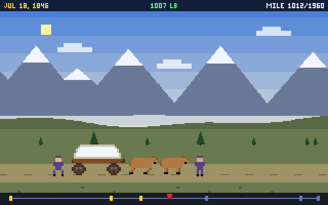

# Trail Ledger

Trail Ledger is a US history journey game for **SpiderBen10's Arcade**, created by **SpiderBen10 (NZDO)**.
It is for **grades 5–12**.

You pick an **expedition**, a real journey at a turning point in US history. Then you:

1. Pack within a budget.
2. Travel a side-view trail, rationing food and paying your way.
3. Decide what to do when historically grounded events come up.
4. Stop at landmarks to read primary sources.

Everything you do goes into your **Ledger**, a field journal that becomes the mission report.

The game has an 80s look:
- a 320×200 canvas with CRT scanlines
- code-defined pixel sprites
- its own bitmap font
- a chiptune bassline, plus an era motif at every landmark



The design plan is `docs/future/trail-ledger-plan.md` in the arcade repository, and the decisions
are in GitHub issue #21.

## v1 expeditions

| # | Expedition | Route | You are | YOUR LEVEL | Landmarks | Events |
|---|---|---|---|---|---|---|
| 1 | **Wagon Road South, 1753** | Bethlehem, PA → Susquehanna → Potomac → Augusta Court House → Dan River → Bethabara (Wachovia), about 520 mi | part of the Moravian settler party (15 Brethren, 1 wagon, 6 horses) | 5–8 | 6 | 16 |
| 2 | **Westward Trail, 1846** | Independence, MO → Fort Laramie → Independence Rock → Fort Hall → The Dalles → Willamette Valley, about 1,960 mi | an emigrant family of 5 with 6 oxen | 5–12 | 6 | 19 |
| 3 | **Northbound, 1917** (Great Migration) | Durham → Richmond → Washington → Baltimore → Philadelphia (settle, or go on) → New York, by rail | a 17-year-old traveling alone and writing letters home | 5–12 | 6 | 16 |

- Every expedition stays playable at every grade from 5 to 12. "YOUR LEVEL" is only a recommendation.
- **Race to the Dan, Route 66, On the Bus and the archive missions** appear as locked
  **"coming later"** cards.
- Kindergarten through grade 4 see a friendly **"Trail Ledger is for grades 5 and up"** screen
  with the ◀ ARCADE link (the same pattern as Page Quest's K–3 gate).
- In the arcade's `site/games.js`, list the game with `grades: ["5", …, "12"]`.

## How it plays

1. **Museum.**
   - The arcade hero is the **museum guide** on the title, intro and report screens.
   - He never appears inside a historical era.
2. **Outfit.**
   - The store starts with a sensible basket (this is the "always pick A" basket). Change it with − and +.
   - Prices are labeled **game numbers**.
   - Grades 9–12 must also stay under the wagon's **load limit**.
   - A **store math** question follows (see the math table below).
3. **Travel.**
   - The side-view strip moves one day at a time.
   - The Ledger panel shows a **forecast line**, for example *"Fort Hall in 220 mi ≈ 16 days at
     14 mi/day; food lasts 12 days. 70 days left before wintered."*
   - Set the **pace** (wagon eras) and the **rations**.
   - Stop to work at any time, and switch to fast travel if you like.
   - Once per leg a **trail forecast** math question uses the real numbers from your trip.
4. **Events.**
   - Every card cites a `source`.
   - Each card offers 2–4 choices.
   - Outcomes are **setbacks, never deaths**: lost days, food or money, a broken axle, lower
     morale, or a sick traveler resting in the wagon.
   - Choices you can't afford are greyed out.
5. **Landmarks.**
   - Each landmark has a scene and a reading written for your band.
   - Public-domain primary-source excerpts are labeled **PRIMARY SOURCE · PUBLIC DOMAIN**.
     Anything paraphrased from a copyrighted work is labeled **RETOLD**.
   - Glosses explain hard words.
   - After the reading come 1–2 questions.
6. **Transmissions.**
   - Between legs, an era-flavored checkpoint arrives: a letter from Bethlehem, a note from a
     trader, a wire from Philadelphia.
   - It carries a question with its explanation.
7. **Food runs out?** You stop to **trade** if you have the money (1 day), or to **work** if you
   don't (3–5 days). Either way it costs days, never health.
8. **The calendar.**
   - Only the calendar can end an expedition early: **WINTERED** (or **JOB FILLED** in 1917).
   - You then **retry the leg from the checkpoint** saved when the leg began. If that leg can no
     longer be finished in time, the retry goes back to an earlier checkpoint.
   - Your answers and Ledger are kept.
9. **Arrival and the mission report.** The report shows:
   - results by NC standard (code and skill), with grade-8 codes marked **preview** for grades 6, 7 and 9
   - a Ledger summary: miles, days compared with the historical pace, food per person per day,
     money spent, earned and left, and work and trade stops
   - **practice next**: your weakest standards, and which expedition covers each one
   - the last Ledger lines

### Grade adaptation

| | Grade 5 | Grades 6–8 | Grades 9–12 |
|---|---|---|---|
| Resources | food, money, days | + spare parts and morale (low morale or no parts slows the wagon) | + era item (trade cloth, trade goods, letters of introduction), a wagon load limit, and trading at Native traders' rates |
| Events per leg | 1, simple | 2, with trade-offs | 2–3; some choices have **consequences that arrive days later** |
| Reading | 38–72 words, read-aloud button | 78–122 words, with glosses | 118–205 words, with sourcing and bias prompts |
| Wrong answer | a **hint** (the wrong choice is struck out), then the answer is shown; no penalty | the explanation, then a small penalty (a day's food) | the explanation, then a penalty (one day, at most once per stop, then food) and a tighter calendar |
| Calendar (Wagon Road / Westward / Northbound, days) | 84 / 212 / 50 | 80 / 198 / 45 | 76 / 186 / 42 |

**Reading levels.**
- Readings are checked with Page Quest's Flesch–Kincaid checker (`npm test` prints the ranges).
- Measured ranges:
  - grade 5: FK 2.9–6.6
  - grades 6–8: FK 6.1–11.0
  - grades 9–12: FK 8.0–12.1
- Primary-source excerpts keep their original wording and are not counted.

### Questions and NC codes

**Era bank.**
- 25 items per expedition per band, so 225 items in all, in `src/data/bank-*.ts`.
- Each item is authored with the correct choice first.
- Each item has an NC Social Studies code:

| Band | Codes used | Shown as |
|---|---|---|
| Grade 5 | 5.G.1.2, 5.G.1.3, 5.H.1.1, 5.H.1.3, 5.E.2.2, 5.B.1.1 | as written |
| Grades 6–8 | 8.H.1.1, 8.H.1.2, 8.H.1.3, 8.H.1.4, 8.H.1.5, 8.G.1.2, 8.E.1.1, 8.B.1.1, 8.C&G.1.1 | grade 8 as written; **grades 6 and 7 see them marked "preview"** (NC teaches world history in 6–7) |
| Grades 9–12 | AH.H.1, AH.G.1.1, AH.G.1.3, AH.E.1, AH.C&G.1, AH.B.1 | grades 10–12 as written; **grade 9 sees the matching grade-8 standard (8.H.1, 8.G.1, …) marked "preview"** |

**Kit social deck.** The arcade kit's social-studies deck is mixed into every third transmission,
but only where it is on topic:
- **grades 5, 8 and 11**: items that match the expedition's topic
- **grade 12**: budgeting items (`EPF.MCM.1.*`)

**Embedded math.**
- Math is generated fresh at the player's **adaptive math level**: `mathGradeFor` chooses the
  grade, `markAdaptive` tags the question, and `recordAnswer` (which calls `noteAnswer`) records
  the answer.
- Every generated question stores its numbers, and `npm test` recomputes every answer with its own
  solver.

| Math grade | Store math (outfit) | Trail forecast |
|---|---|---|
| 3–4 | adding prices (NC.3.NBT.2); making change (NC.4.NBT.4) | food division facts (NC.3.OA.3); full days with remainders (NC.4.NBT.6) |
| 5 | totals with quantities and making change from the real basket (NC.5.NBT.7) | days to the next landmark, how long food lasts (NC.5.NBT.6) |
| 6 | unit rates, percent of the budget (NC.6.RP.3) | rates: miles in *t* days (NC.6.RP.3) |
| 7 | percent markup and discount (NC.7.RP.3) | proportional food use (NC.7.RP.2) |
| 8 | linear cost function *c = mp + b* (NC.8.F.4) | rate of change from two Ledger entries (NC.8.F.4) |
| 9–11 | budget with a fixed cost, *ux + f ≤ B* (NC.M1.A-REI.3) | *d = rt* solved for *t* (NC.M1.A-CED.1); average rate of change (NC.M1.F-IF.6); smallest pace with *Dr ≥ M* (NC.M1.A-REI.3) |
| 12 (player grade) | **budget share and emergency money, tagged EPF.MCM.1.1** | as for 11 |

### Codes to verify

The official NC DPI pages are blocked in this sandbox, so these were checked only through search
excerpts and the kit's `banks/social/NOTES.md`.

**Objective-level codes not seen in full text:**
- grade 5: 5.G.1.2, 5.G.1.3, 5.H.1.3
- grade 8: 8.H.1.1–8.H.1.5, 8.G.1.2, 8.C&G.1.1
- high school: AH.G.1.3

The kit marks **8.H.1.1** as "text not seen".

**Standard-level codes** (objective unknown): AH.H.1, AH.E.1, AH.C&G.1, AH.B.1.

**Course range.** American History standards cover 1763 to the present, so AH codes on Wagon Road
1753 items are a stretch. They are kept because grades 9–12 may play every expedition.

**Math codes.** Grades 10–11 reuse NC Math 1 codes (A-CED.1, A-REI.3, F-IF.6), because the trail
math is linear. Check whether NC Math 2 and 3 objectives fit better. Also check NC.3.OA.3 and
NC.4.NBT.6 as tags for "food lasts" division.

**EPF.MCM.1.1** (budgeting) follows the kit's re-coding from EPF.MM to EPF.MCM.

## Sensitive history and the trademark

**Trademark and tropes.**
- "Oregon Trail" never appears in the title or the UI. Readings say "the trail" or "the overland
  trails".
- There are no tombstones, no "you have died of", no ford/caulk/ferry menu, no hunting game and no
  profession picker. River crossings are fixed fees. Nobody dies.

**Native nations** are named nations with agency: traders and guides who **set their own prices**.
- Wagon Road: Lenape, Susquehannock and Conestoga, Catawba, Cherokee.
- Westward: Kaw (Pappan's ferry), Lakota, Shoshone, Cayuse, Nez Perce, Wasco and Wishram, Kalapuya.

**Hard history** is stated plainly and never shown: the Walking Purchase, the Paxton Boys (1763),
Moravian slaveholding (1769), and Oregon's exclusion laws.

**Northbound** is serious throughout:
- Segregation is described accurately and without graphic detail.
- When the player meets it, every choice is a **historically documented response**: packing a
  shoebox lunch, writing to the Black press, mutual aid, churches and the Urban League, savings banks.
- The player never enforces segregation.
- There is no comedy.

**Lint.** `npm test` lints every string for:
- slurs and slur fragments, "savage", "died of" and other death tropes, and the trademark
- hunting or shooting verbs in anything the player does
- comedy markers in Northbound

Sources are in **[docs/sources.md](docs/sources.md)**, with notes on what was checked and what to
spot-check.

## Controls

| Action | Keyboard | Touch / mouse |
|---|---|---|
| Pick an expedition | 1–3 | tap a card |
| Answer, or choose an event option | **1–4 or A–D** | tap a choice |
| Continue | Enter or Space | the yellow button |
| Pace / rations | G / F | Pace and Rations buttons |
| Stop to work | W | "Stop to work" |
| Fast travel | T or → | "Normal ▶ / Fast ▶▶" |
| Read aloud (replay) | R | speaker button |
| Pause | P (Esc resumes) | PAUSE in the toolbar |
| Mute | M | SOUND in the toolbar |

- A–D are never movement keys.
- Read-aloud is off by default for grades 5 and up. It is stored with the kit (`setReadAloudPref`).
- The game pauses when the window loses focus.
- The grade comes from `?grade=` (shown as a badge with **CHANGE GRADE IN THE ARCADE**). Without
  it, the game shows a K–12 picker.

## Code layout

| Path | What it holds |
|---|---|
| `src/data/types.ts` | the data model |
| `src/data/wagon-road.ts`, `westward.ts`, `northbound.ts` | era files: legs, landmarks with three band passages, events, store, transmissions, calendar |
| `src/data/bank-*.ts` | era question banks |
| `src/data/standards.ts` | bands, codes, preview mapping |
| `src/sim/sim.ts` | the pure resource simulation shared by every era |
| `src/sim/trailmath.ts` | generated trail math |
| `src/game/game.ts` | the flow (no DOM): outfit, landmarks, travel queue, events, penalties, checkpoints and retry, report data |
| `src/game/questions.ts` | era and math question sources |
| `src/game/kitmix.ts` | kit adaptive math and social-deck mix-in (browser only) |
| `src/render/*` | canvas: scenes, sprites, bitmap font, HUD and route strip |
| `src/ui/Panel.tsx`, `tl.css` | the Ledger panel and the Ledger book under the canvas |
| `src/text/readability.ts` | Flesch–Kincaid checker (copied from Page Quest) |
| `src/text/lint.ts` | banned-word lint |
| `scripts/check-trail.ts` | `npm test` |
| `scripts/playtest.cjs` | Playwright playtest |
| `src/kit/` | the arcade kit, unmodified |

## Tests (`npm test`)

About 78,000 checks:
- **Simulation.** The simulation is checked against an independent reference implementation for
  every era, band, pace, ration and food level.
- **Every expedition is finishable at every grade from 5 to 12.** Bots play seven strategies each,
  including **worst-case "always pick A" with every answer wrong**. Both endings of Northbound are
  played. **Wintered** stops and the **retry from the checkpoint** are tested at grades 5, 8 and 11.
- **Math.** 12,000 generated questions are recomputed.
- **Sources.** Every event and landmark has a source. Public-domain excerpts must cite a pre-1929
  publication, and the rest must be labeled "retold".
- **Lint and reading level.** The banned-word lint runs on every string, and reading level and
  length are checked per band.
- **Bank rules.** One correct answer, 4 distinct choices, the quick limits when an item is quick,
  NC code forms, unique ids and prompts.
- **Data integrity.** Leg miles add up to the landmark miles, each band has enough event cards per
  leg, and the default baskets fit the budget and load limit. Canvas text has bitmap glyphs,
  sprite grids are valid, and every scene has a painter.

## Running

```bash
npm install
npm run dev        # http://localhost:8080 (add ?grade=8 to start like the arcade does)
npm test           # data, simulation, finishability, math, lint and reading-level checks
npm run build      # tsc strict + vite build into dist/
```

**Playtest.**
1. Run `npm run build && npx vite preview --port 4641 --host 127.0.0.1 &`.
2. Run `node scripts/playtest.cjs`. Add `SHOT=docs/screenshot.png` to also save the 640×400 canvas
   shot.

The playtest covers grade 3 (the gate) and grades 5, 8 and 11. Each of those grades plays all three
expeditions, one per mode: keyboard at 1280×800, iPad landscape touch at 1080×810, and iPad
portrait touch at 810×1080.

Add `?debug` to expose the game as `window.__tl.game`. Its `step()` advances one trail day.

## Deploying

Trail Ledger lives in SpiderBen10's Arcade repository (`games/trail-ledger/`). The arcade's deploy workflow
builds and tests it and publishes it at `/trail-ledger/` on the arcade's Azure app, so it needs no Azure
app or token of its own. See the arcade README.

## Credits

Created by **SpiderBen10 (NZDO)** for SpiderBen10's Arcade. The game, characters, art and music are
original. The game borrows only the *mechanic* of 1980s journey sims. "The Oregon Trail" is a
trademark of its owner and is not used.

Primary sources:
- the Moravian records (Fries, 1922)
- Lansford Hastings's *Emigrants' Guide* (1845)
- the migrant letters collected by Emmett J. Scott in the *Journal of Negro History* (1919)

Modern histories are retold, not quoted. Built with React, TypeScript and Vite.
