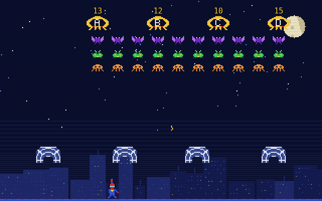

# Web Invaders

A *Space Invaders*-style arcade game for **SpiderBen10's Arcade**, created by **SpiderBen10 (NZDO)**.
Players in grades K–12 answer math, science and ELA questions (NC Standard Course of Study) to
save the city from marching bug invaders.



- Rows of pixel bugs march side to side and down, dropping stingers. The SpiderBen10 hero runs along
  the rooftops and shoots webs upward. Spider-web shields soak up hits and tear apart as they do.
- **Every wave carries a question.** It appears in the banner above the screen. Four big
  **answer invaders** labelled A–D carry the four choices, with the choice text shown above each one.
- Web the invader with the **right answer** and the whole wave is cleared, with a bonus and a streak
  multiplier (×2 to ×5). Web a wrong one and the formation gets angry: it drops and marches faster.
  The right answer flashes and the explanation is shown. Then you clear the rest of the bugs to finish the wave.
- You can't always get under every answer invader in time, so pressing **A–D / 1–4** (or tapping an
  answer in the banner or on screen) throws a **homing web** at that invader. You get one pick per wave,
  so every answer can always be reached.
- If the invaders land, you lose a life and the answer is shown. You have 3 lives, and each wave is faster than the last.
- At game over, a **mission report** lists your results by NC standard (code and skill) and what to practise next.
  Accuracy per standard is saved in the browser, and the question deck brings missed standards back more often.

## Grades and subjects

The title screen has a K–12 grade picker. It starts on the grade from the arcade link (`?grade=`),
or on the last grade you played in this browser. Next to it is the subject picker: Math, Science, ELA or Mixed.
Questions come from the shared arcade kit (`src/kit`, imported as `@/kit`). Only short "quick" items are used,
so they can be read at arcade speed. High-school grades map to NC courses (NC Math 1–4, English I–IV, science courses).

| Grade | What changes |
|---|---|
| K–2 | Slower march, gentler drops, fewer and slower stingers, a longer grace period, 2 rows of bugs, bigger question text. **Read-aloud is on by default**: the question and choices are spoken, and the speaker button (or **R**) replays them |
| 3–12 | 3 rows of bugs. The march and bomb speed step up with the grade band and with every wave |

Read-aloud, sound and grade choices are remembered in the browser.

## Controls

| Keyboard | Touch (phones/tablets) | Action |
|---|---|---|
| ← / → | ◀ ▶ | Move |
| Space / Z / X / ↑ | FIRE | Shoot a web |
| A–D or 1–4 | tap an answer in the banner or above an invader | Homing web at that answer (one pick per wave) |
| R | speaker button | Read the question aloud again |
| P / Esc, M | toolbar | Pause, mute |

The toolbar also has **◀ ARCADE**, which goes back to the arcade menu and keeps the grade, plus a sound toggle and a read-aloud toggle.

## Run it locally

```sh
npm install
npm run dev        # http://localhost:8080
npm run build      # type-check + production build into dist/
```

`src/kit` is the shared arcade kit. Copy the canonical `kit/` folder there before building.

## Deploying

Web Invaders lives in SpiderBen10's Arcade repository (`games/web-invaders/`). The arcade's deploy workflow
builds and tests it and publishes it at `/web-invaders/` on the arcade's Azure app. (It used to have its
own repository and Azure app; the repository is archived.)

## Credits

Game design and characters: **SpiderBen10 (NZDO)**. The hero is an original character.
