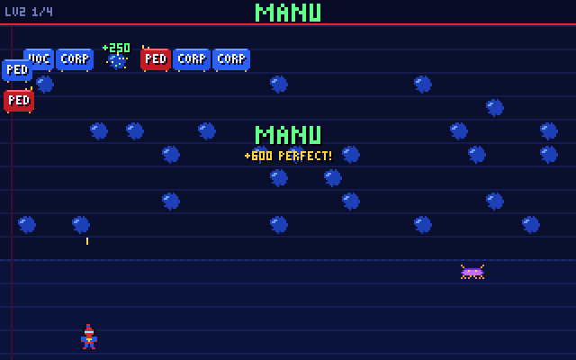

# Word Worm

A *Centipede*-style arcade game for **SpiderBen10's Arcade**, created by **SpiderBen10 (NZDO)**.
Players in grades K–12 practise phonics, spelling, prefixes, suffixes, Greek and Latin roots and
commonly confused words (NC Standard Course of Study for ELA) by shooting the right segments of a
winding word worm.



- A segmented **word worm** winds down a notebook page, turning at the edges and at **ink blots**
  (this game's mushrooms). The SpiderBen10 hero patrols the bottom rows, moving left, right and a
  little up and down, and fires **ink darts** upward, one at a time, as in the classic.
- **Every segment carries a letter or a word part.** The banner says what to shoot, for example
  *Spell CAT*, *Shoot the letter that makes the /b/ sound, as in BALL*, *Shoot the prefix that
  makes HAPPY mean "not happy"*, *Shoot the root that means "earth"*, or *Shoot the wrong letter: SAYD*.
  The **tray** (in the banner and at the top of the screen) fills in as the word is built.
- **Right segment:** it pops, scores (with a streak bonus up to ×5), leaves an ink blot, and splits
  the worm in two. The back half turns away as a new worm, as in the classic.
- **Wrong segment:** it flashes red, the worm speeds up, you lose a shield pip, and the banner
  explains why (for example *"HYDR means water. GEO means earth, as in GEOGRAPHY."* or
  *"Not O. FOX needs F next."*).
- **Always completable.** A pick strip under the prompt shows up to four labels that are still on
  the worm, always including the one you need. Press **1–4** (or **A–D** when the labels are word
  parts, not single letters), tap a strip button, or **tap a segment on the screen**, and a homing
  dart flies to it, through the blots. Wrong segments are never removed, and right ones are only
  removed when shot, so the part you need is always on the worm.
- **Ink mite:** an original spider-like pest skitters through the hero's rows (300/600/900 points
  when you shoot it, more the closer it is). It nibbles blots.
- If a worm segment or the ink mite touches the hero, a shield pip absorbs the hit; with no shield
  left you lose one of 3 lives. After a hit the worm pieces regroup at the top of the page.
- Each level has 3 worms (K–2) or 4 worms (3–12). Between levels an **incoming transmission** asks
  an ELA question from the shared kit bank: a right answer refills the shields and scores a bonus;
  a wrong one still gives +1 shield and shows the explanation.
- At game over, a **mission report** lists results by NC standard (code and skill), from worms and
  transmissions, plus *practice next* and the words to review. Worms you missed come back a few
  worms later in the same game.

## Grades and what the worms carry

The title screen has a K–12 grade picker. When the game is opened from the arcade with `?grade=`,
it shows that grade and a *CHANGE GRADE IN THE ARCADE* link instead. Otherwise it starts on the last
grade played in this browser, or grade 2.

| Grade | Worm challenges | NC ELA codes |
|---|---|---|
| K | Letter sounds (consonants and short vowels, with a keyword), rhymes, spell CVC words, sight words (Dolch-style) | RF.K.3 (rhymes), RF.K.4 (letter sounds, spelling, sight words) |
| 1 | Digraphs (sh, ch, th, wh, ck, ng), silent-e words, vowel teams, rhymes, sight words | RF.1.3 (rhymes), RF.1.4 |
| 2 | Vowel teams and blends/digraphs in chunks (B-OA-T, SPL-A-SH), fix a misspelled word | RF.2.4, L.2.2 |
| 3 | Prefix/suffix meaning, build words (RE+READ), high-frequency spelling, fix a misspelled word | L.3.4, L.3.2 |
| 4 | Affix and root meanings (tele, graph, port...), build words, homophones (their/there/they're...) | L.4.4, L.4.1 |
| 5 | Latin and Greek roots, build words (INTER+RUPT), tricky spellings (necessary, separate...) | L.5.4, L.5.2 |
| 6 | Greek and Latin roots (geo, chron, therm...), build words, commonly confused words (affect/effect...) | L.6.4, L.6.1 |
| 7 | Roots and prefixes (bene, mal, circum, manu...), build words, confused words (lay/lie, principal/principle...) | L.7.4, L.7.1 |
| 8 | Roots (theo, phil, morph, nym...), build words, commonly misspelled words (embarrass, mischievous...) | L.8.4, L.8.2 |
| 9–10 (English I–II) | Advanced roots (corp, mort, flect, loqu, pseudo...), build academic words, commonly misspelled words (accommodate, rhythm, millennium...) | L.9-10.4, L.9-10.2 |
| 11–12 (English III–IV) | Advanced roots (crypt, noct, bell, vert, flu...), build words, commonly misspelled words (supersede, minuscule, connoisseur...) | L.11-12.4, L.11-12.2 |

There are 411 worm challenges (K 56, 1 42, 2 29, 3 37, 4 35, 5 28, 6 26, 7 28, 8 25, 9–12 26–27 each):
98 for K–1, 66 for 2–3, 63 for 4–5, 79 for 6–8 and 105 for 9–12.
They live in `src/words/`, built with the helpers in `src/worm/challenges.ts`.

**Difficulty by grade band.** K–2: the slowest worms, 12 blots, the ink mite rarely and slowly,
3 worms per level, big letters on the segments and in the banner. **Read-aloud is on by default** for
K–2: each worm's target is spoken (*"Spell cat. C, A, T."*, *"Shoot the letter that makes the buh
sound, as in ball."*), then the pick strip (*"1: B. 2: D..."*); each right letter is echoed, and
wrong shots are explained aloud. The speaker button (or **R**) says it again. Grades 3–5, 6–8 and
9–12 get faster worms, more blots and a more frequent, faster mite. Every level is a little faster.

### Standards codes to verify

The official NC DPI site is blocked in this sandbox, so these codes follow the kit's notes
(`src/kit/banks/ela/NOTES.md`) and Common Core placement:

- **RF.K.4 / RF.1.4 for spelling and sight words.** NC numbers K–1 phonics as RF.x.4 (after its
  handwriting standard). Coding *encoding* (spelling CVC words) there assumes NC's phonics standard
  covers decoding and encoding; sight words follow Common Core RF.K.3c/RF.1.3g.
- **L.2.2, L.3.2, L.5.2, L.8.2, L.9-10.2, L.11-12.2** for spelling (NC's conventions continuum).
- **L.4.1** (homophones), **L.6.1** and **L.7.1** (commonly confused words): Common Core puts
  frequently confused words at L.4.1g and carries it forward as a progressive skill; the grade where
  NC's grammar continuum lists each pair is not confirmed. These are the least certain codes.
- **L.x.4** (roots and affixes) for grades 3–12: assumed to match the Common Core anchors.

## Controls

| Keyboard | Touch (phones/tablets) | Action |
|---|---|---|
| ← → ↑ ↓ | ◀ ▶ ▲ ▼ | Move (up/down only inside the hero's rows) |
| Space / Z / X | FIRE | Fire an ink dart (one on screen at a time) |
| 1–4 (A–D for word parts) | tap a strip button or a segment | Homing dart at that segment |
| A–D or 1–4, then Enter | tap | Answer a transmission, then continue |
| R | speaker button | Read the target aloud again |
| P / Esc, M | toolbar | Pause, mute |

When the worm carries single letters, only **1–4** pick from the strip (the strip shows 1–4), so
pressing the letter *C* never fires at the wrong segment. The toolbar also has **◀ ARCADE**, which goes
back to the arcade menu and keeps the grade, plus sound and read-aloud toggles.

## Run it locally

```sh
npm install
npm run dev        # http://localhost:8080
npm run build      # type-check + production build into dist/
npm test           # checks every grade's word lists (scripts/check-words.ts)
```

`npm test` checks, for every grade: enough items per grade and band, no duplicate ids or words,
that every spell/build target is spelled by its parts (and the worm's labels can spell it only one
way), that letter-sound decoys never make the target sound, that rhymes rhyme and decoys don't,
that every root/affix and homophone decoy has a different meaning, that every misspelling is one
wrong or extra letter, that standards codes match the grade, that labels have glyphs and fit a
segment, and that the pick strip always includes the needed part.

`scripts/playtest.cjs` is an automated Playwright playtest (needs `npx vite preview --port 4401`):
it plays level 1 at grades K, 3, 7 and 11 with the keyboard at 1280×800 and with touch at 1080×810,
checks the grade badge and the picker, the aimed and homing shots, a wrong shot's reason, the
transmission (key and tap), the layout and the mission report. `?debug` exposes the engine as `window.__ww`.

`src/kit` is the shared arcade kit. Copy the canonical `kit/` folder there before building.

## Deploying

Word Worm lives in SpiderBen10's Arcade repository (`games/word-worm/`). The arcade's deploy workflow
builds and tests it and publishes it at `/word-worm/` on the arcade's Azure app, so it needs no Azure
app or token of its own. See the arcade README.

## Credits

Game design and characters: **created by SpiderBen10 (NZDO)**. The hero and the ink mite are original characters.
